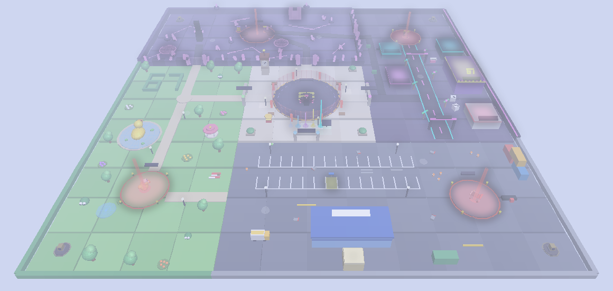
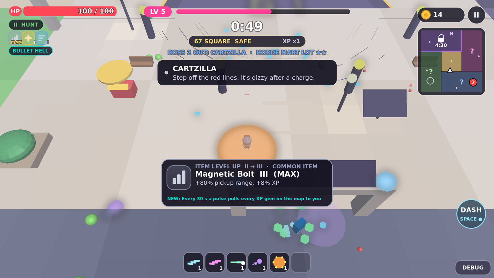
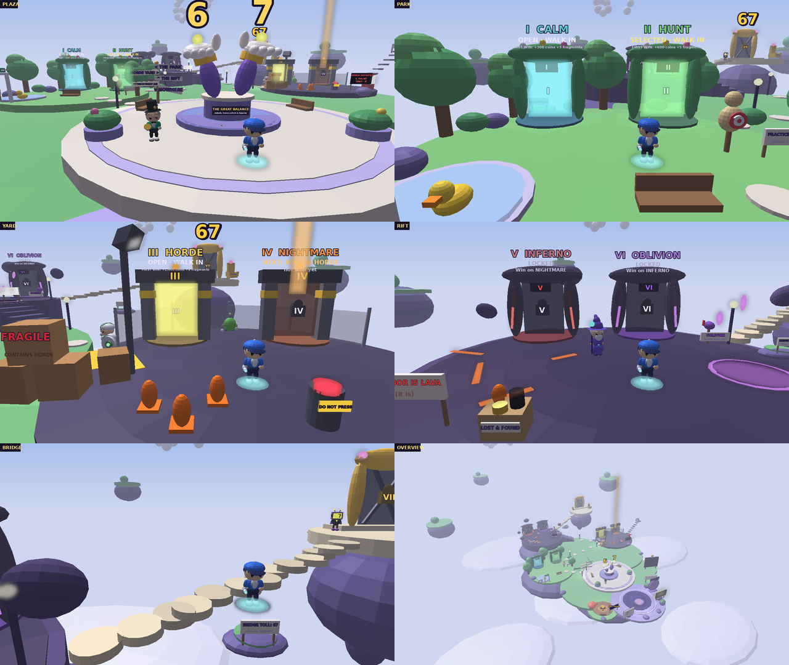
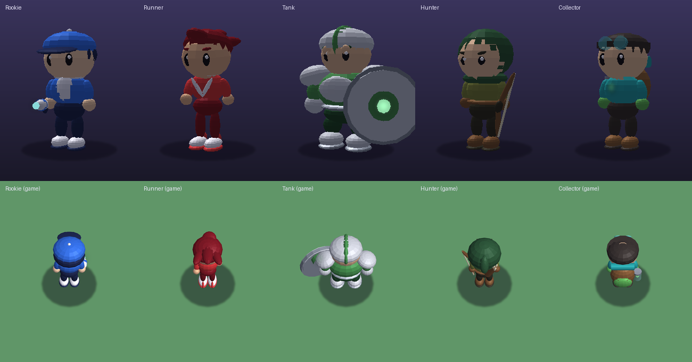
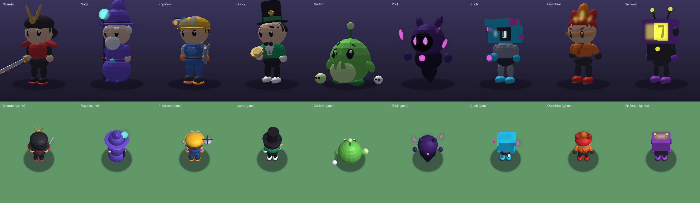
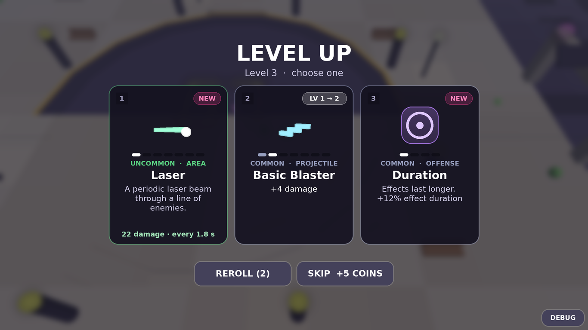
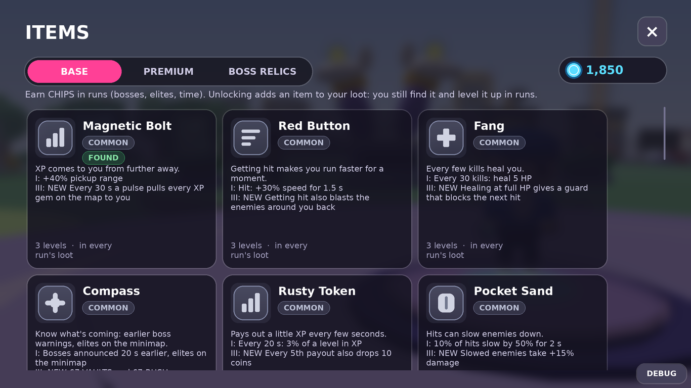

# 67 SURVIVAL

> Roblox survivor-like: **ДВИГАЙСЯ → ВЫЖИВАЙ → УБИВАЙ → XP → LEVEL UP → ВЫБИРАЙ СПОСОБНОСТЬ → СТАНОВИСЬ СИЛЬНЕЕ → ОРДА → БОСС → НАГРАДА → НОВЫЙ ЗАБЕГ**.
> Способности атакуют сами, орда растёт каждую минуту, боссы в своих зонах на 3:00, 6:00, 9:00 и 12:00, главный — в центре на 15:00. Забег — 15 минут.
> 15 героев, 30 способностей + 12 эволюций, 8 боссов, редкие **67-события**, Collection Book, AFK Camp, пати.

Рядом лежат две другие игры репозитория: [The Doppelgänger Obby](../README.md) и [Chile Simulator](../ChileSimulator/README.md).

---

## Обновление: бестиарий · премиум-способности · плавность

### Бестиарий: 28 врагов по сложностям
На каждой сложности 2 обычных врага + своя элита + главный босс (15:00). Все модели — свои, из примитивов, в стиле чиби-героев (большая круглая голова, SmoothPlastic, Neon-глаза, местами знак «6»/«7»): обычные ≤ 10 частей, элиты ≤ 18, боссы ≤ 45. Каждая атака с телеграфом (красный круг / линия / конус заполняется от центра).

| Сложность | Тема | Обычные | Элита | Босс |
|---|---|---|---|---|
| I CALM | луг | Gloopy (прыгает), Buzz Bat (зигзаг, рывок) | King Gloop (прыжок с ударной волной, делится на 3) | **MEGA SIX** — прыжок-удар, веер слизи, 50% SWELL, слизни-спутники режут урон |
| II HUNT | кладбище | Boo Sheet (медленнее, когда смотришь на него), Bonk Skull (замирает и таранит) | Pumpkin Knight (щит спереди — заходи сбоку) | **COUNT SEVEN** — телепорт за спину, рой мышей, 50% BLOOD MOON |
| III HORDE | пустыня | Wrappy (оставляет бинты), Scorp (жало издалека) | Sand Golem (удар кулаком) | **PHARAOH SIXSEVEN** — песчаная буря, хлопки, големы, плитки |
| IV NIGHTMARE | мороз | Snowy Pal (снежки), Frost Wisp (ледяной след) | Yeti Chonk (рывок и шипы) | **EMPEROR PENGUIN PRIME** — скольжение, сетка шипов, 50% FREEZE |
| V INFERNO | вулкан | Magma Bun, Imp Pop (взрывается) | Obsidian Crab (панцирь до трещины) | **DRAKO 67** — огненное дыхание, взлёт, 50% WILDFIRE |
| VI OBLIVION | кибер-глитч | Pixel Bit (прыгает вбок), Drone Pod (лазер) | Firewall Bot (щит, зовёт пикселей) | **OVERCLOCK-6** — лазер по кругу, цифровой дождь, голограммы, 50% OVERCLOCK |
| VII THE 67 | пустота | Voidling (притягивает), Star Eater (бросает луны) | Eclipse Knight (тёмный круг, выпад) | **THE 67** — финал: 6-удар, 7 лучей, чёрные дыры, 66% ECHOES (эхо всех боссов), 33% «67» |

* Данные — в `src/shared/EnemyData.lua` (роль `EnemyConfig`: HP, скорость, урон, XP, монеты, `Spawn` = вес/с какой минуты/стая, `AnimType`, атаки, фазы) и `BossData.lua` (`Mains` — главный босс каждой сложности). Поведение: `Sim/Bestiary.lua` (орда и элиты), `Sim/BossPatterns.lua` (атаки боссов).
* Модели: `Render/BestiaryModels.lua`; анимация без ключевых кадров — `Render/EnemyAnimator.lua` (подпрыгивание со своей фазой, сжатие-растяжение, наклон по ходу, крылья/плащи/челюсти через `Motor6D.C0`; дальше 70 studs и при толпе > 120 — упрощённо).
* **Модели в Studio:** `ReplicatedStorage/Enemies/<n СЛОЖНОСТЬ - Тема>/<Ключ>` — настоящие `Model`, их можно открыть и поправить руками. Игра берёт их, если у папки `Enemies` атрибут `UseInGame = true` (по умолчанию модели строятся кодом). Пересобрать папку: в командной строке Studio `require(game.ServerStorage._Tools.EnemyBuilder).Build()`; офлайн: `lune run tools/export_models.luau`.
* **Откат к старым врагам:** копии прежних скриптов — `ServerStorage/_Backup_Enemies` и `ServerStorage/_Backup_Scripts` (в репозитории `backup/`), состояние до обновления — коммит `72e3ced`; вернуть прежних главных боссов — одна строка `BossData.Mains`.

### Способности: один стиль эффектов и редкости
`src/shared/AbilityConfig.lua`: цвет эффекта = цвет редкости (Common `#E5E7EB`, Uncommon `#4ADE80`, Rare `#3B82F6`, Epic `#A855F7`, Legendary `#FACC15`, Mythic — переливается розовый → бирюзовый → золотой), с каждым уровнем эффект крупнее и ярче (второе кольцо с 4-го), на максимальном уровне — своя «макс-форма»; на каждом попадании — неоновая вспышка, цифра урона, лёгкая отдача. Не больше 12 частиц на эффект, линии не тоньше 0.6. Карточки способностей — как карточки героев, у Mythic бегущий блик по рамке. Звуки — заготовки `AbilityConfig.Sounds` (пустые id, `-- TODO`).

### Премиум-способности (Mythic, за Robux)
SOLAR BEAM 67 · BLACK HOLE PET · GOLDEN METEOR SHOWER (+50% монет с убитых ими) · TIME BUBBLE (враги внутри −60% скорости, твои снаряды быстрее) · PHOENIX FAMILIAR (раз за забег поднимает на 40% HP) · CHAIN STORM (молния через 12 врагов) · AURA CROWN (кольцо с «6» и «7», на максимуме 3 кольца). Действие — `Sim/PremiumAbilities.lua`, вид — `Render/PremiumFx.lua`.
* **Не pay-to-win:** каждая не сильнее чем в 1.3 раза лучшей бесплатной способности той же категории — на 1-м и на максимальном уровне, в толпе и против одной цели. Это меряется настоящей симуляцией: `lune run tools/power.luau` (таблица) и тест `[premium]`.
* Владелец видит свою премиум-способность в **первом level up** забега, дальше — с весом `AbilityConfig.PremiumWeight`. Стартовой её выбрать нельзя.
* **Бесплатная проба раз в день:** SHOP → PREMIUM → TRY IT FREE — сегодняшняя (не купленная) способность сразу будет в следующем забеге.
* **SHOP → PREMIUM:** карточки в стиле героев, кнопка покупки через `MarketplaceService`; пока `ProductId = 0` — **COMING SOON** (в Studio — TEST BUY). Там же **скины способностей** Gold / Rainbow / Void / Ice и **Trail Pack** (трейлы Comet / Sakura / Pixel, один трейл на игрока).
* **ID и цены:** вставь ID в `AbilityConfig.Premium`, `AbilityConfig.Skins`, `AbilityConfig.TrailPack` (`ProductId`, `Type = "Gamepass"` или `"Product"`); пассы и продукты в `MonetizationData` строятся из них сами. Цены — только в панели Roblox.

### Плавность
Все тайминги — `GameConfig.Feel`: враг вырастает из земли (Back, 0.25 с) с облачком; при смерти «лопается» (×1.15 → 0 за 0.2 с) и бросает 4–6 частиц, кристаллы и монеты выпрыгивают дугой и летят к игроку с ускорением; попадание — белая вспышка всей модели 0.08 с и отдача; цифры урона пружинят, криты крупнее и золотые; камера чуть отстаёт, «вздыхает» FOV при уроне и воскрешении, тряска ограничена и выключается в настройках; полоски HP/XP заполняются твином; карточки level up выезжают пружиной, выбранная увеличивается; у босса — баннер, тёмная виньетка, полоска HP плавно проявляется. На сервере скорость врагов сглаживается (рывки и боссы — мгновенно), толпа расталкивается через хеш-сетку. Пулы врагов, снарядов, эффектов и цифр урона.

---

## Как запустить

### ▶ Самый простой способ — один файл
В **корне репозитория** лежит `67Survival.rbxlx` — в нём вся игра (карта, скрипты, интерфейс). Двойной клик по нему (или по `PLAY_67Survival.bat` / `.command` рядом) → откроется Roblox Studio → нажми **Play (F5)**. Ничего скачивать и собирать не нужно.

### ▶ Одной кнопкой со сборкой из исходников
* **Windows:** двойной клик по `PLAY.bat` · **macOS:** `PLAY.command` (первый раз: правый клик → «Открыть»)

Скрипт сам скачает Rojo (один раз, в `tools/`), соберёт игру из `src/` и откроет её в Roblox Studio. Дальше — **Play (F5)**.

### Разработка через Rojo
`rojo serve` в этой папке → плагин Rojo в Studio → **Connect**. Пересборка: `rojo build default.project.json -o 67Survival.rbxlx`.
Лучше всего тестировать через **Test → Clients and Servers** (пати, бонус друзей) или на телефоне через **Device Emulator**.

### Сохранения в Studio
*Game Settings → Security → Enable Studio Access to API Services* (место должно быть опубликовано). Без этого игра работает в режиме памяти и пишет об этом в лобби и в настройках.

### Управление
| | Движение | Карточки level up | Пауза | Эмоция |
|---|---|---|---|---|
| ПК | WASD / стрелки, колесо — зум | клик или `1`–`4`, `R` — reroll | `Esc` / `P` | `G` |
| Телефон / планшет | виртуальный джойстик (Roblox Thumbstick), щипок — зум | тап | кнопка `II` | — |
| Геймпад | левый стик | `A` `X` `Y` `B`, `RB` — reroll | `Start` | — |

**Атака полностью автоматическая.** Прыжок в арене выключен, поэтому на телефоне нет лишних кнопок. **Рывок** появляется только с предметом Rocket Skates (или Cart Wheel / Void Eye): `Space` / `Shift` на ПК, кнопка **DASH** на телефоне, `R2` на геймпаде.

### Отладка
Кнопка **DEBUG** (внизу справа) есть только у **создателя игры**: владельца места (для группы — участники с рангом ≥ `GameConfig.AdminGroupRank`) и id из `GameConfig.AdminUserIds`. У обычных игроков её нет вообще, в Studio тоже (игроки «Local Server» — обычные игроки); только неопубликованное место пускает того, кто тестирует в Studio. Команды: +1 минута, сразу к боссам (2:55 / 5:55 / 11:55), любое из 8 **67-событий**, +5 уровней, **EVOLVE** (сразу эволюция), god mode, убить всех, умереть, монеты, +100 фрагментов, AFK +2 часа, открыть всё, максимум мета-улучшений, сетевая статистика. То же чатом: `/time 300`, `/boss TheGiant`, `/event The67`, `/level 5`, `/evolve`, `/fragments 100`, `/afk 120`, `/god`...
Покупки за Robux в Studio симулируются (ID не настроены) — можно проверить каждую награду.

---

## Первые 30 секунд
Первые губеры уже идут к тебе → стартовая способность героя стреляет сама → XP-кристаллы → **первый LEVEL UP через ~5–7 секунд** → 3 карточки → выбор → врагов больше. Никаких обучающих экранов: в самом первом забеге — маленькая карточка **HOW TO SURVIVE** (WASD — двигаться · оружие бьёт само · собирай XP-кристаллы · улучшения клавишами 1–3; на телефоне — про джойстик и касание карточки). Она держится 10 секунд игрового времени (`GameConfig.Tutorial.HintSeconds`), прячется, пока открыт выбор улучшения, и не показывается тем, кто уже играл. Всё подробно — **MORE → HOW TO PLAY**.

## Интерфейс: один экран — одна цель


**Хаб** — минимальный, взгляд сразу идёт к **PLAY**. За интерфейсом — живая 3D-сцена: твой герой стоит на подиуме справа (мягкий тёплый свет спереди, холодный контровой сзади, дуга округлых колонн, далёкий светящийся «67» в глубине резкости, несколько медленно парящих огоньков), дышит и машет руками, а камера чуть-чуть «плывёт». Центральная колонка:
* **логотип 67 SURVIVAL** и короткий подзаголовок («Survive. Level up. Become unstoppable.»);
* свободное пространство;
* пилюля **сложности** `‹ III HORDE x1.3 REWARDS ›` — стрелки переключают открытые уровни, нажатие открывает экран сложностей;
* **PLAY** — чуть ниже центра экрана (~61% высоты), большая и чистая; при наведении плавно увеличивается, под ней мягко проступает свечение и тень;
* маленькие чипы, только когда нужны: награда дня, AFK Camp, пати, событие;
* внизу тихая навигация **HEROES · ABILITIES · ITEMS · SHOP · MORE** (точка — есть что открыть или купить).

Сверху справа — монеты, фрагменты, профиль, настройки (уведомления в хабе появляются под ними, не поверх логотипа); слева — маленькая карточка **DAILY QUEST**; справа под 3D-героем — компактная табличка (имя, редкость, лоадаут, CHANGE). Путь: **ГЕРОЙ → СЛОЖНОСТЬ → PLAY**. Камера держит героя в правой трети на любом экране (от 21:9 до телефона), чуть снизу, так что табличка не закрывает героя.

**MORE** — окно-сетка 3×3: ACHIEVEMENTS, COLLECTION, CHALLENGES, AFK CAMP, PARTY, LEADERBOARD, STATISTICS, CODES, CREDITS. Всё второстепенное живёт здесь (настройки — шестерёнка сверху).
**HEROES** — выбор героя большими карточками: 3D-модель, имя, редкость, LOCKED / OWNED / EQUIPPED, пассивка, уникальная механика, стартовая способность, цена во фрагментах; сверху LOADOUT 1/2/3. **ABILITIES** — все способности по категориям, рецепты эволюций, выбор стартовой способности (SET START), улучшения level up с категориями и числом уровней. **ITEMS** — все предметы (BASE / PREMIUM / BOSS RELICS): что делают, уровни и новая механика, где падают, FOUND; премиум-предметы и реликты открываются за **CHIPS**. **SHOP** — UPGRADES (мета-улучшения за монеты), COSMETICS (12 категорий), BOOSTS, PASSES (+ коды).

| Герои | Коллекция | AFK Camp |
|---|---|---|
|  |  |  |

| Способности | Косметика | MORE |
|---|---|---|
|  |  |  |

**HUD в забеге** — минимум: сверху уровень, тонкая полоска опыта и таймер; слева HP; справа монеты и пауза; полоска босса — только пока жив босс; внизу иконки способностей с уровнем (рамка **EVO** — готова к эволюции, **MAX** — максимум), активные баффы (67%, TURBO, TINY...) и пилюля **EVOLUTION AVAILABLE**. На телефоне иконки справа, подальше от джойстика. Весь билд — в меню паузы.

| HUD с боссом | Эволюция | 67-событие | Итоги |
|---|---|---|---|
|  |  |  |  |

**Читаемость героя:** своя модель героя получает белый контур (Highlight, виден сквозь орду) и светящееся кольцо под ногами; враги — без контура, боссы — крупнее и с полоской HP. Все атаки врагов и боссов **телеграфируются** (красные круги, линии, зоны), снаряды врагов — контрастного цвета.

Стиль: тёмные полупрозрачные панели, размытие мира за меню, тонкие границы; белый текст, **один акцент** (розовый: PLAY, опыт, выбранное; меняется косметикой **UI Theme**), **золото** — монеты и награды, **фиолетовый** — фрагменты; красный — только опасность, зелёный — только успех / OWNED / EQUIPPED. Цвета редкостей: Common серый, Uncommon зелёный, Rare синий, Epic фиолетовый, Legendary золотой, Mythic бирюзовый (эволюции), Secret розовый. Шрифты Builder Sans; мемный Luckiest Guy — только логотип «67» и 67-момент. Вместо эмодзи — 3D-превью (ViewportFrame) героев, способностей, врагов и шапок.

**Адаптивность:** всё размечено в единицах 1100×620 и масштабируется `UIScale` (Scale + AnchorPoint + layouts, безопасные отступы). На телефонах в горизонтали — холст 1000×520, элементы крупнее; высокие окна сами ужимаются. Проверено отрисовкой при 1920×1080, 1600×900, 1366×768, планшете 1024×768 и телефоне 844×390 (см. «Тесты»).

| Телефон: хаб | Телефон: забег |
|---|---|
|  |  |

## Карта забега: 67 TOWN


Арена 480×480 студов — маленький городок из **пяти зон** вокруг площади (вертушка). Стоять на месте невыгодно, всё зовёт идти дальше: **ВРАГИ → XP → LEVEL UP → СПОСОБНОСТИ → ПРЕДМЕТЫ → СИНЕРГИИ → ЭЛИТЫ → БОССЫ 1–4 → ГЛАВНЫЙ БОСС**.

| Зона | Где | Опасность | Враги / награда | Что там |
|---|---|---|---|---|
| **67 SQUARE** «Safe-ish. For now.» | центр | SAFE | ×1; через 3:00 опыт на площади падает до ×0.8 — пора уходить | **THE 67 ARENA** в центре (круг R=44, золотой обод, «67» в полу, 8 пилонов, кольцо печати), часовая башня (всегда 6:07), карта «YOU ARE HERE (probably)», тележка 67 DOGS |
| **GOOBER GARDENS** | запад | ★ | XP ×1.1; больше губеров, сплиттеров, прыгунов | пруд с огромной уткой, лабиринт из живой изгороди в форме «67», беседка, пикник |
| **HORDE MART LOT** | юг | ★★ | HP ×1.12, XP и монеты ×1.25; чарджеры, бомберы, бруты | парковка (место 67 — «RESERVED»), магазин HORDE MART, тележки, 67 TACOS |
| **NEON STRIP** | восток | ★★★ | HP ×1.25, XP ×1.4, монеты ×1.5; блинкеры, снайперы | неоновый бульвар, 67 CASINO, закусочная, ломбард «PAWN 67 — WE BUY SIXES», задний переулок |
| **THE RIFT** | север | ★★★★ | HP ×1.45, XP ×1.7, монеты ×1.6, элиты ×2.5; призраки, призыватели | трещины, кристаллы, парящие скалы, обелиск; **закрыт силовым полем до 4:30** (3 прохода, на воротах таймер) |

* **Зачем двигаться:** опасные зоны платят больше; первый заход в зону — пачка XP-кристаллов; каждые ~2 минуты **67 RUSH** (одна зона ×1.67 XP и ×2 монеты на 40 с); **67 VAULT** в углах зон просыпается на минуту — постой на площадке 4 с, и выпадет **предмет**; каждые 3 минуты **босс** ждёт в логове своей зоны, а в 15:00 — **THE FINAL ONE** в арене в центре.
* **Боссы 1–4 живут в логовах своих зон** (сады ★ → парковка ★★ → стрип ★★★ → разлом ★★★★): приходят ровно по таймлайну, подходишь — дерутся, убегаешь далеко — идут домой лечиться. Подробно — раздел «Боссы».
* **Миникарта** (правый верхний угол) — **только в забеге**, в лобби её нет. Зоны (неисследованные — «?»), замок разлома с таймером, ты, **босс — большой красный маркер с номером (1–4), мигает у логова, пока идёт предупреждение**; THE FINAL ONE — огромный маркер «67» в центре; кольцо арены (с 14:30, яркое пока арена запечатана); элиты (фиолетовое «E»), предметы на земле (цвет редкости), души, проснувшееся хранилище, RUSH; логово следующего босса видно всегда. Маркеров не больше 28, обновление 10 раз в секунду. Прячется под level up, паузой и итогами.
* **Стрелки у края экрана:** «BOSS 2 · 140» (номер и расстояние), «THE FINAL ONE», элиты рядом, предметы, хранилище, сундуки, фрагменты, редкие враги.
* **Секреты:** место 67 на парковке (**Perfect Parking**), трещина в разломе (**Mind the Gap**, предмет с таблицы Secret), подсобка HORDE MART за стеной (**No-Clip**, секретный предмет **Suspicious Rock**), TICK TOCK до будильника (**Right On Time**).
* Враги обходят здания и препятствия (атрибут `EnemyBlocker`), в разлом идут через проходы; **вода** (атрибут `Water`: пруды, лужи пустоты) замедляет до 75% (`GameConfig.Water`; боссов и летающих — нет).
* Экономно: ~820 деталей арены (вместе с лобби ~1370, e2e держит < 1500), всё Anchored; подсветка логов/хранилищ/проходов/арены у каждого игрока своя (`ArenaController`), столбы света гаснут, когда подходишь (не закрывают бой).

Отладка уровней: `/main TheDread` (главный босс любого уровня), `/boss Mannequin` (новый босс слота), `/spawn Wailer` (любой враг рядом, пары — парой), `/affix Echo` (элита с аффиксом).

Отладка: кнопки **2:45 BOSS 1 … 14:45 MAIN / NEXT BOSS NOW / MAIN BOSS NOW / ELITE / ITEM / 67 VAULT / 67 RUSH / +1000 CHIPS / UNLOCK ITEMS**, чат `/boss 2`, `/boss Cartzilla`, `/main`, `/elite`, `/item RocketSkates`, `/chips 1000`, `/vault`, `/rush`. Картинки: `lune run tools/town_sheet.luau && python3 tools/town_sheet.py` (виды с камеры забега, `build/town`), `lune run tools/enemy_sheet.luau -- <ключи> && python3 tools/enemy_sheet.py <ключи>` (модели врагов и боссов: спереди, 3/4, сбоку и с камеры забега), вид сверху — `lune run tools/export_map.luau && python3 tools/render_map.py` (`docs/map.png`).

|  |  |
|---|---|

Базовое освещение задаёт `MapBuilder` (лёгкая дымка Atmosphere, мягкий Bloom для неона, аккуратная цветокоррекция).

## Лобби: 67 LAND — карта событий


Лобби — это маленький **парящий остров над облаками**, по которому можно гулять: лестница сложности, которую проходишь ногами. Каждая из 7 сложностей — это **EVENT GATE** в своей зоне, и чем дальше по маршруту, тем выше, темнее и опаснее:

| Зона | Ворота | Что там |
|---|---|---|
| **SPAWN** | — | сцена хаба (твой герой на подиуме), AFK CAMP с палаткой, карта острова «YOU ARE HERE», QUICK PLAY (твоя сложность), доска **TODAY IN 67 LAND** (живые события дня), табличка «WELCOME TO 67 LAND · POPULATION: 67 (APPROX.)» |
| **THE PLAZA** | — | монумент **THE GREAT BALANCE**: две огромные перчатки ладонями вверх взвешивают «6» и «7» и по очереди качаются, как в меме; бассейн желаний, указатель, HALL OF SURVIVORS (доска рекордов), гид |
| **THE PARK** | I CALM, II HUNT | садовые арки из живой изгороди, пруд со спасателем-уточкой, тренировочный манекен, деревья |
| **THE HORDE YARD** | III HORDE, IV NIGHTMARE | забор, стальные ворота с полосами «caution», прожектор, ящик «FRAGILE: CONTAINS HORDE», счётчик орды, охранник |
| **THE RIFT** (на плато, по лестнице) | V INFERNO, VI OBLIVION | каменные ворота со светящимися трещинами, лава, дыра в мир с осколками, парящие скалы, хранитель разлома |
| **THE 67 SUMMIT** (по парящему мосту) | VII THE 67 | золотой остров, золотая арка под огромным светящимся «67» (ориентир, видно отовсюду), трон «RESERVED», робот THE 67 |

* **Ворота показывают ТВОЁ состояние** (у каждого игрока своё, рисует клиент `EventMapController`): открытые — светящийся портал «OPEN · WALK IN» и награда за первую победу; выбранные — «SELECTED»; **NEXT** — закрытая дверь с замком, цель и прогресс («best 6:32 / 10:00»); дальше — «LOCKED», рамка приглушена. **Столб света** стоит на твоих следующих воротах — видно, куда идти.
* **Войди в открытые ворота — начнётся забег на этой сложности** (сервер проверяет открытие, как меню сложности); в закрытые не пройти, а игра подскажет, что их откроет.
* **Камера**: на подиуме — витрина хаба, как раньше; стоит отойти — плавно переходит в обзор острова (выше, шире, почти без размытия). Камера всегда смотрит на север, поэтому все таблички повёрнуты к ней.
* **NPC** (настоящие модели героев) говорят короткие реплики, когда подходишь: гид, охранник, кто-то, кто смотрит в стену, хранитель разлома, THE 67 («6.» «7.» «...» «6?»).
* **Секреты острова** (в Collection Book, по 67 монет): лестница в никуда за двором, выступ под мостом с «платой за проход», трон 67, кнопка DO NOT PRESS (нажми 67 раз), трава «DO NOT TOUCH» за воротами CALM.
* **Шутки** (их замечаешь не сразу): облака на горизонте складываются в «67», аварийный выход у края обрыва, «LIFEGUARD ON DUTY» у утки, «PRACTICE HORDE (1): please be gentle», автомат «COURAGE — SOLD OUT», «HORDE DEFEATED 6,700,067», «THE FLOOR IS LAVA (it is)», LOST & FOUND со шляпами героев, почтовый ящик «OBLIVION: no mail since 1967», табличка «sign_text_FINAL_v2 (1)», «NO EVENTS TODAY. Suspicious.», храпящая палатка; упал с острова — вернёт на старт со словами «It happens to the best of us».
* Экономно: ~550 деталей, 16 точечных источников света, 4 слабых эмиттера частиц (FEWER EFFECTS их выключает), всё Anchored; вместе с ареной — ~1320 деталей.

## Забег (15 минут)
| Время | Что происходит |
|---|---|
| 0:00 | старт в THE 67 ARENA на площади, Goober |
| 0:25 | + Skitter (стаями) |
| 0:55 | **HERE THEY COME**: кольцо губеров вокруг игрока, + Husk |
| 1:30 | + Charger |
| 2:05 | **NEW ENEMIES**: Spitter, Splitter, Bomber |
| 2:50 | орда редеет: время дойти до садов |
| 3:00 | ⚠ **БОСС 1** (★ GOOBER GARDENS): THE BIG QUACK / THE GOOBER / THE GIANT |
| 3:20–4:00 | первые **элиты** |
| 4:20 | **THE HORDE GROWS**: Brute, Diver, Leaper, Summoner; 4:30 — **разлом открыт** |
| 6:00 | ⚠ **БОСС 2** (★★ HORDE MART LOT): CARTZILLA / THE MACHINE / TICK TOCK |
| 7:00 | **SNIPERS**: + Sniper, Ghost, Mimic |
| 9:00 | ⚠ **БОСС 3** (★★★ NEON STRIP): JACKPOT JIMMY / THE GLITCH / THE 67 KING; до 2 элит сразу |
| 10:00 | **EXTREME PHASE** |
| 12:00 | ⚠ **БОСС 4** (★★★★ THE RIFT): SIX & SEVEN / THE VOID / THE OVERLORD |
| 13:00 | **THE LAST WAVES** |
| 15:00 | ⚠ **ГЛАВНЫЙ БОСС уровня** в центре (THE 67 ARENA; на HUNT — THE FINAL ONE) → убил = **VICTORY** |
| 17:00+ | OVERTIME (если главный босс ещё жив): орда без предела |

На уровнях сложности поверх этой классической орды приходят **новые враги** (I — Snoozer, II — Shielder, III — Stampeder и Bannerman, IV — Wailer и Hexer, V — Cinder и Eruptor, VI — Predator и Warden, VII — Sixlet + Sevenlet), каждый со своей минуты (`WaveData.TierPools`).

Каждый босс: за 10 с — предупреждение (**«⚠ BOSS 2» → «CARTZILLA IN 10 · HORDE MART LOT · tests area damage · pressure»**), логово загорается (красное кольцо + столб света), маркер на миникарте, стрелка с расстоянием, строка таймлайна под зоной в HUD («BOSS 2 IN 0:42 · HORDE MART LOT ★★» → «BOSS 2 OUT: CARTZILLA»), эффект появления. Кого не стали бить — уходит без лута, когда объявляют следующего. Каждый level up лечит 8 HP.
Здоровье и урон врагов растут со временем (`WaveData.HPScale / DamageScale`). Если врагов мало, спавн ускоряется (`MinAlive`), отставших переносит вперёд — орда никогда не «рассасывается».


## Герои (15)
Каждый герой — отдельная стилизованная модель (не стандартный персонаж Roblox) с узнаваемым силуэтом, своим оружием, характерным аксессуаром и цветовым акцентом, своей стартовой способностью, пассивкой и уникальной механикой.

**Визуальный язык моделей — «smooth + clean + minimal»:** тело, голова, руки и ноги — гладкие эллипсоиды (Part + SpecialMesh Sphere), детали — шары и цилиндры, острые грани только там, где это и есть дизайн (клинок катаны, экран THE 67, кубическая голова THE GLITCH). Пропорции «игрушечные»: крупная голова с блестящими глазами, компактное тело. Материалы: SmoothPlastic, Metal (оружие, броня, золото), Glass (линзы, визоры) и Neon **только для энергии** (сфера посоха, пламя, визор, экран «67»), не больше 6 неоновых деталей на героя. Руки и ноги — на Motor6D: при ходьбе они шагают и машут в такт, в покое герой дышит, эмоции получили позы (настоящий взмах рукой, «флекс», жест «6 7» ладонями). Шапка-косметика заменяет собственный головной убор героя (кепку, шляпу, каску), а не надевается поверх.

**Первая пятёрка (THE ROOKIE, THE RUNNER, THE TANK, THE HUNTER, THE COLLECTOR) сделана заново, в одной системе дизайна** (`face()`, `kitArms()`, `kitLegs()` в `HeroModels.lua`): большая голова (~40% роста); на лице только два крупных глаза с бликом, а настроение задают брови и веки (добрый Rookie, энергичный Runner, спокойный Tank, сосредоточенный Hunter, хитрый Collector); компактный торс, короткие руки с крупными кистями, короткие ноги с объёмной обувью; 2–4 цвета и один главный силуэт у каждого: кепка + бластер, волосы по ветру + кроссовки, наплечники + круглый щит, капюшон + лук + колчан, рюкзак + светящаяся банка. Риг прежний: те же Motor6D рук и ног, `HatAt`, `Top`, скины.



**Ещё девять героев сделаны заново в той же системе** (та же голова, те же глаза, те же руки и ноги; у существ и роботов — свои формы, но тот же язык лица), у каждого свой силуэт:
* **THE SAMURAI** — кабуто с золотыми рогами, красные наплечники и нагрудник, одна длинная катана со светящейся кромкой; взгляд сосредоточенный;
* **THE MAGE** — мантия-«груша» до пола, мягкая шляпа с загнутым концом, белые брови и борода, посох с голубым шаром; спокойный, веки полуприкрыты;
* **THE ENGINEER** — жёлтая каска с очками, синий комбинезон с большим карманом, оранжевые перчатки, гаечный ключ и круглый дрон над плечом (винт крутится в игре); одна бровь приподнята;
* **THE LUCKY** — изумрудный костюм, белая рубашка и бабочка, белые перчатки, цилиндр набок с золотым четырёхлистным клевером и большая золотая монета; хитрый прищур;
* **THE GOOBER** — одна мягкая капля без шеи и ног, светлый живот, большие глаза, антенна; двое крошечных друзей бегают вокруг него в игре;
* **THE VOID** — тёмная форма без тела, уходящая в дымку, «уши»-пламя, лицо из темноты с двумя светящимися глазами, маджента-сердце, парящие руки и три осколка, кружащие в игре;
* **THE GLITCH** — единственный «блочный» герой: кубическая голова-экран с пиксельными глазами, верхний срез головы сдвинут вбок (глитч) с маджента-кромкой, рука-пушка, пиксели вокруг;
* **THE OVERDRIVE** — гоночный костюм, янтарный визор, волосы-пламя со светящейся сердцевиной, наклон в рывок, руки отведены назад; брови резко вниз;
* **THE 67** — коробка-робот: фиолетовая голова, жёлтый экран, на котором цифры «67» (сегментный дисплей из деталей, поэтому они видны и в превью меню) — это его глаза, две антенны, тёмное тело с одним огоньком.

Парящие детали (винт дрона, друзья Goober, осколки Void, пиксели Glitch) крутятся на тех же Motor6D, что и пропеллер шапки: клиентский `HeroAnimator` уже умеет их вращать. THE UNKNOWN остался прежним.



| Герой | Редкость | Старт | Пассивка | Механика | Открытие |
|---|---|---|---|---|---|
| THE ROOKIE | Common | Basic Blaster | +10% XP, +1 reroll | первые 5 level up лечат 15 HP | сразу |
| THE RUNNER | Common | Boomerang | +25% скорость, −15% HP | 20% шанс увернуться в движении | сразу |
| THE TANK | Common | Shockwave | +40% HP, +1 броня, −15% скорость | шипы: касание ранит врагов | сразу |
| THE HUNTER | Uncommon | Piercing Arrow | +25% дальность, +10% крит | +40% урона боссам и элите | 15 фрагментов |
| THE COLLECTOR | Uncommon | Sigma Aura | +60% магнит, +25% монет | XP +15%, монеты падают на 50% чаще | 15 |
| THE SAMURAI | Rare | Katana | +15% площадь, +10% урон | каждый 4-й удар ×3 и шире | 40 |
| THE MAGE | Rare | Magic Missile | −10% кулдауны | +1 снаряд у ракет и болтов | 40 |
| THE ENGINEER | Rare | Drone | +10% длительность | +1 дрон, дроны +25% урона | 40 |
| THE LUCKY | Rare | Lightning | +50% удача | 67-события чаще, сундуки +1 карта | 40 |
| THE GOOBER | Epic | Pulse Blast | +10 HP | 2 помощника со старта, +1 каждые 10 уровней | 70 |
| THE VOID | Epic | Orbital Blades | +5% урон | быстрые убийства: +1% урона (до +40%) | 70 |
| THE GLITCH | Epic | Laser | +10% скорость | вместо удара — телепорт (раз в 5 с) | 70 |
| THE OVERDRIVE | Legendary | Rocket | +5% скорость атаки | до +60% скорости атаки при низком HP | 110 |
| THE 67 | Mythic | 67 Orb | +6.7% урон и XP, +67% удача | каждое 67-е убийство — бесплатный 67 BLAST; 67-события ×3 | 167 или «Seen It All» |
| THE UNKNOWN | **Secret** | Chain Lightning | +15% ко всему | 2 случайные способности и 1 revive | победить THE 67 |

Выбор стартовой способности (ABILITIES → SET START) и **лоадауты** (герой + способность, слоты 2–3 — с пассом) — в меню героев.

## Сложность (7 уровней)


Перед забегом: **ГЕРОЙ → СЛОЖНОСТЬ → PLAY**. Экран **DIFFICULTY** — «лестница» уровней слева и подробности справа: описание, **правила** (новые помечены NEW), что получают враги и боссы, награды, рекомендуемый уровень аккаунта, условие открытия с прогрессом, кнопки SELECT и PLAY. Цвет каждого уровня — только в акцентах (цифра, полоска, лёгкий оттенок): от спокойного бирюзового до напряжённого красного и золота; в самом забеге картинку слегка тонирует настроение уровня, а в HUD под HP — плашка уровня.

| Уровень | Враги (HP / урон / скорость) | Боссы (HP / урон) | Орда · элита | Награды | Правила | Открывается |
|---|---|---|---|---|---|---|
| **I CALM** | ×0.7 / ×0.6 / ×1 | ×0.65 / ×0.6 | ×1 · ×0.5 | ×0.9 | — | сразу |
| **II HUNT** (классика) | ×1 / ×1 / ×1 | ×1 / ×1 | ×1 · ×1 | ×1 | — | победить босса на CALM |
| **III HORDE** | ×1.2 / ×1.1 / ×1.08 | ×1.2 / ×1.1 | ×1.1 · ×1.3 | ×1.3, +1 фрагм., +5% удачи | FASTER HORDE | продержаться 10:00 на HUNT |
| **IV NIGHTMARE** | ×1.5 / ×1.25 / ×1.1 | ×1.45 / ×1.2 | ×1.2 · ×2.5 | ×1.6, +2, +10% | + ELITE INVASION, BOSS RAGE | победа на HORDE |
| **V INFERNO** | ×1.9 / ×1.4 / ×1.12 | ×1.8 / ×1.3 | ×1.3 · ×3 | ×2, +3, +15% | + CHAOS, GLITCH | победа на NIGHTMARE |
| **VI OBLIVION** | ×2.4 / ×1.6 / ×1.15 | ×2.2 / ×1.45 | ×1.4 · ×3.5 | ×2.5, +4, +20% | + LOW XP, NO MERCY | победа на INFERNO |
| **VII THE 67** | ×3 / ×1.8 / ×1.18 | ×2.7 / ×1.6 | ×1.5 · ×4 | ×3.2, +6, +30% | + 67 CHAOS | победа на OBLIVION |

HUNT — классическая игра: те же числа, тайминги волн, боссы слотов, аффиксы элит и THE FINAL ONE; поверх классического микса приходят только Snoozer и Shielder (уровни I–II), экономика классики не изменилась. Баланс проверен ботом (`tests/sim.luau … <уровень>`, герой с максимальной метой, 8 сидов): среднее время жизни I→VII — 15:08, 11:30, 9:01, 8:00, 7:33, 6:28, 5:48; кривая ровная, без обрывов. Бот играет заметно хуже человека (даже на HUNT побеждает ~1 раз из 8), поэтому верхние уровни — первый проход, их числа удобно подкрутить в `shared/DifficultyData.lua`. С новой ордой, аффиксами и боссами уровней (24 сида, максимальная мета) средняя жизнь III→VII — 11:41, 11:48, 9:28, 6:07, 5:35 (было 13:15, 11:28, 11:10, 7:58, 7:15); HUNT без меты — 8:33 и 9:16 на двух наборах сидов (было 7:39 и 9:32), CALM — 63% побед (было 74%): верхние уровни стали жёстче за счёт нового контента, кривая осталась ровной. Ручки: `WaveData.TierPools` (веса, минуты) и `WaveData.TierShare` (доля новой орды, сейчас 15%), `MinTier` аффиксов в `EnemyData.EliteAffixes`.

**Что открывает каждый уровень** (всё накапливается: на VII есть всё):

| Уровень | Новые враги | Новые аффиксы элит | Боссы слотов | Главный босс (15:00) |
|---|---|---|---|---|
| I CALM | Snoozer | только SWIFT, ARMORED | классика | **MAMA GOOBER** |
| II HUNT | Shielder | все 6 классических | классика | **THE FINAL ONE** |
| III HORDE | Stampeder, Bannerman | SHIELDED | +1 новый в каждом слоте | **THE HORDEMASTER** |
| IV NIGHTMARE | Wailer, Hexer | CURSED, BERSERK | — | **THE DREAD** |
| V INFERNO | Cinder, Eruptor | BURNING, GRAVITY | +ещё один новый в каждом слоте | **THE FURNACE** |
| VI OBLIVION | Predator, Warden | THORNED, ECHO | — | **THE ERASER** |
| VII THE 67 | Sixlet + Sevenlet | GILDED 67 | все | **THE 67 PRIME** |

**Правила:** FASTER HORDE — орда быстрее · ELITE INVASION — элита с 1:30 и намного чаще · BOSS RAGE — боссы сразу с атаками ярости и впадают в ярость раньше (70% HP) · CHAOS — 67-события чаще плюс случайные «сюрпризы арены» · GLITCH — каждые 10–14 с часть орды глитчем появляется рядом · LOW XP — −15% опыта · NO MERCY — короче замахи (телеграфы укорачиваются вместе с ними — всё честно), быстрее выстрелы, плотнее орда · 67 CHAOS — 67-события длятся дольше, лут удваивается, THE 67 и 67 BOSS чаще.

**Награды:** множитель монет и опыта аккаунта; с HORDE — фрагменты за каждый забег от минуты и ещё раз за победу; удача (редкие карты, дроп, фрагменты с элиты); **бонус первого прохождения** каждого уровня (300…6700 монет, 3…30 фрагментов); достижения за победу на II–VII с косметикой (Horde Ribbon, Nightmare Shatter, Inferno Crown, Oblivion skin, **Crown of 67** — секретная шапка) и **титулы** на табличке над героем (Nightmare Walker, Inferno Walker, Beyond Oblivion, THE 67). Высокие уровни **не нужны** для обычного прогресса: героев, способности и улучшения можно открыть на любом уровне. В пати играют на уровне лидера. Старые профили ничего не теряют: всё, что было пройдено до сложностей, считается уровнем HUNT.

## Способности (30 + 12 эволюций)
Все атакуют сами, 7 уровней. Редкость влияет на шанс выпасть в карточках.

| Категория | Способности |
|---|---|
| **PROJECTILE** | Basic Blaster · Pulse Blast · Piercing Arrow · Magic Missile · Rocket · Boomerang · Banana Bomb |
| **AREA** | Sigma Aura · Fire Ring · Ice Field · Poison Cloud · Meteor · Shockwave · Lightning · Chain Lightning · Laser · Black Hole |
| **MELEE** | Katana · Giant Fist · Sword Storm · Orbital Blades |
| **SUMMON** | Drone · Clone · Goober Friends |
| **DEFENSIVE** | Barrier · Glitch |
| **SPECIAL** | 67 Orb · Chaos · 67 Blast (Legendary) · Sigma Stare (Secret) |
| **PASSIVE** (22) | Power, Rapid Fire, Expansion, Swiftness, Wisdom, Magnet, Vitality, Regeneration, Greed, Duration, Crit Master, Armor, Luck, Vampire, Berserk, Orbital Mastery, Burn Mastery, Double Shot, Execution, XP Storm, **67%** (Legendary), Touch Grass (Secret) |

18 способностей открыты сразу, остальные — за фрагменты (12 / 25 / 40) или достижение; Sigma Stare и Touch Grass — секреты.

### Эволюции
Способность на **максимальном уровне** + нужная пассивка → на экране **EVOLUTION AVAILABLE**, а следующий level up (или сундук) первой карточкой предлагает эволюцию (Mythic, с бирюзовой рамкой). Карточки пассивок, которые завершают рецепт, подсвечены («Evolves Katana»). Рецепты видны в ABILITIES.

| База | + пассивка | → эволюция |
|---|---|---|
| Basic Blaster | Rapid Fire | **OVERDRIVE BLASTER** — непрерывный поток пробивающих болтов |
| 67 Orb | Orbital Mastery | **67 CHAOS ORB** — шесть взрывающихся сфер |
| Fire Ring | Burn Mastery | **INFERNO RING** — всё вокруг горит |
| Chain Lightning | Crit Master | **STORM CALLER** — бесконечные цепи молний |
| Katana | Berserk | **BLOOD MOON** — круговые удары с вампиризмом |
| Drone | Double Shot | **DRONE SWARM** — шесть дронов |
| Black Hole | Magnet | **SINGULARITY** — две воронки, притягивают XP |
| Magic Missile | Wisdom | **ARCANE STORM** — шторм самонаводящихся ракет |
| Rocket | Expansion | **NUKE LAUNCHER** — очень большой взрыв |
| Boomerang | Swiftness | **CYCLONE** — пять огромных бумерангов |
| Ice Field | Armor | **ABSOLUTE ZERO** — враги внутри замерзают |
| Laser | Duration | **DEATH RAY** — два бесконечных луча |

## Level up


Игра останавливается, 3 карточки (у сундука — 3–4): новая способность, уровень способности, **улучшение** (50 штук в 5 категориях) или **уровень предмета** (редко, с 8 уровня, только для предметов, что у тебя уже есть); эволюция готова — она первая. Карточка: иконка, название, редкость и категория, **«LV 2 → 3»** (или NEW / MAX), полоски уровней, короткое изменение этого уровня («+1 bolt»), **NEW MECHANIC** золотом, если уровень меняет поведение, и синергия, к которой ведёт выбор («⟡ BULLET HELL 2/4»). Невозможных карточек нет: улучшения снарядов — только если есть снарядная способность, улучшения рывка — только с рывком, уровень никогда не больше максимума. Все новые улучшения вместе весят как 16 (`GameConfig.LevelUp.NewPassiveShare`) — 50 улучшений не вытесняют способности.

| Категория | Улучшения (уровней; что меняет последний уровень) |
|---|---|
| **OFFENSE** | Power (5; ×3 урон с шансом 5%), Fast Hands (5; каждый 10-й каст дважды), Crit Master (5; криты перескакивают), Brutal (5; криты ломают броню), Giant Slayer (5; слабые места +50%), Execution (5; добивание), Opening Strike (5; первый удар +50%), Combo (5; взрыв на полном комбо), Rampage (5; ударная волна за 30 убийств), Expansion (5; ауры замедляют), Duration (4; оглушения дольше), Burn Mastery (3; огонь перекидывается), Orbital Mastery (3; орбиты +30% по боссам), 67% |
| **PROJECTILES** | Multishot (3; +пробитие), Velocity (5), Big Shots (5), Penetration (5), Ricochet (5; рикошет ищет боссов), Split (5; дробление на 3), Homing (5), Explosive Rounds (5; поджог), Return Policy (5), Chain Reaction (5) |
| **DEFENSE** | Vitality (5; лечение раз в 20 с), Armor (4; боссы бьют слабее), Regeneration (5), Plating (5; щит-броня с отбрасыванием), Tough Skin (5; удар не больше 25% HP), Slippery (5; уклонение сбивает с ног), Last Stand (5), Panic Button (4), Vampire (4), Berserk (4; ниже 50% HP быстрее) |
| **MOVEMENT** | Swiftness (5; лужи и лёд не замедляют), Momentum (5), Tailwind (5), Marathon (5), Dash Master (5; рывок бьёт), Roadrunner (5; растаптываешь врагов) |
| **XP** | Wisdom (5; бесплатный reroll), Magnet (4; «пылесос» всех кристаллов), Collector's Streak (5), Bounty Hunter (5), Trophy Hunter (3; босс = level up), Alchemy (3), XP Storm (2; быстрее в шторм), Greed (4; монета ×6.7), Luck (4; элиты чаще дают предметы) |

Редкости: **Common → Uncommon → Rare → Epic → Legendary → Mythic → Secret**; Mythic — только эволюции, Secret — только после находки секрета. Reroll и Skip (+5 монет). Сундуки — «TREASURE» с повышенным шансом редких карт, **67 CHEST** — +1 карта и больше удачи. Способности (30) тоже с уровнями, и у каждой 2 уровня меняют поведение (рикошет, дробление, взрыв в конце, заморозка, оглушение, поджог, цепь, эхо, послешок, возврат и т.д.).


## 67-события (8)
Редкие, не во время боссов, не повторяются подряд. Затемнение → «6»… «7»… → **«67»** (мемный шрифт, зум камеры) → название события. В пати событие лидера видят все.

| Событие | Что происходит |
|---|---|
| **67% EVENT** | +67% урона, +67% XP, +67% врагов |
| **67 CHEST** | появляется золотой сундук — добеги |
| **67 INVASION** | вся орда разом (лимит врагов почти ×2), но враги слабее |
| **67 LUCK** | редкие карты и дроп повсюду, 67-гоблин, ящики |
| **67 CHAOS** | каждые 2.5 с что-то случайное |
| **67 MODE** | TINY (враги на 67% меньше) / TURBO (всё на 67% быстрее) / GLASS (×2 урон в обе стороны) / GIANT (огромные враги, ×2 XP) |
| **67 BOSS** | появляется **THE 67 KING** |
| **THE 67** | очень редкий враг кружит вокруг и бросается шестёрками и семёрками; убей, пока не ушёл |

Пассивка `67%` гарантирует 67-событие через несколько секунд. Герои THE 67 и THE LUCKY видят события чаще; по выходным (**67 WEEKEND**) события в 2 раза чаще.

## Враги (15 + редкие)
| Враг | Поведение |
|---|---|
| **Goober** | слабый, толпой |
| **Skitter** | крошечный, быстрый, стаями |
| **Husk** | медленный, пустой взгляд |
| **Charger** | останавливается, топает и таранит по прямой |
| **Spitter** | держит дистанцию и плюётся слизью |
| **Splitter** | делится на трёх при смерти |
| **Bomber** | бежит с горящим фитилём — красный круг взрыва (ранит и врагов) |
| **Blinker** | телепортируется ближе |
| **Brute** | огромный, медленный, почти не отбрасывается |
| **Diver** | кружит сверху, потом пикирует по линии |
| **Summoner** | держится сзади и призывает скиттеров |
| **Ghost** | исчезает: в это время не бьёт и неуязвим |
| **Leaper** | прыгает туда, где ты был (круг приземления) |
| **Mimic** | притворяется ящиком с лутом |
| **Sniper** | красная линия прицела → выстрел по ней |
| **67 Goblin** (редкий) | убегает с мешком монет |
| **THE 67** (очень редкий) | см. 67-события |
| **Golden Goober** (секрет) | 1 из 500 губеров золотой |
| **Loot Box** | снеки, магнит, бомба, монеты |

**Новые враги уровней сложности** (`EnemyData` MinTier, поведения — `Sim/EnemyManager`):

| Враг | Уровень | Поведение |
|---|---|---|
| **Snoozer** | I | спит, где упал; подошёл близко (или ударил) — моргает 0.8 с и бежит |
| **Shielder** | II | большой щит спереди: удары в лоб почти не проходят и прикрывают орду сзади; заходи сбоку или ломай щит |
| **Stampeder** | III | топает (линия 0.8 с) и бежит по прямой всё быстрее, почти не поворачивает; стадо идёт шеренгой |
| **Bannerman** | III | держится за ордой, всё в его кольце бегает быстрее — убей первым |
| **Wailer** | IV | держит дистанцию, воет медленной волной-кольцом с одним разрывом |
| **Hexer** | IV | рисует круг проклятия под тобой — через 1.2 с взрыв |
| **Cinder** | V | уголёк: оставляет огненный след на несколько секунд |
| **Eruptor** | V | почти стоит, бросает лаву туда, где ты стоишь (круг 1.3 с) |
| **Predator** | VI | бежит не к тебе, а туда, где ты будешь; прыжок по линии (0.75 с) |
| **Warden** | VI | медленный; в его пузыре орда получает −40% урона |
| **Sixlet + Sevenlet** | VII | ходят парой; убил одного — второй дрожит 3 с и звереет на 5 с (быстрее, светится); убил обоих за 3 с — без ярости |

## Боссы: 4 слота + главный босс уровня
Одна система для всех боссов (`BossData` → `Sim/BossDirector` → `Sim/MiniBosses`). В каждом слоте босс выбирается случайно из пула, у каждого: имя, модель и силуэт, HP, урон (по слоту), передвижение, базовая/вторая/особая атака, AoE, телеграфы (красные круги/линии до удара), **фазы** (объявляются, ускоряют атаки, добавляют приёмы), **слабое место** (после своей атаки босс «открыт» — плашка WEAK POINT, урон ×1.5–1.8), награда, лут (предметы по таблице слота, свой **босс-реликт**, если открыт, снек, XP, монеты, фрагменты), рост HP от силы билда, эффект смерти. Слот — это то, что босс проверяет.

| Слот | Когда · где | Проверяет | Боссы (HP) · слабое место |
|---|---|---|---|
| **1** | 3:00 · сады ★ | урон, движение, позиционирование | THE BIG QUACK (2 400) · BELLY UP; THE GOOBER (2 500) · WOBBLING; THE GIANT (2 500) · FIST STUCK |
| **2** | 6:00 · парковка ★★ | AoE и давление | CARTZILLA (7 000) · DIZZY; THE MACHINE (7 800) · OVERHEATED; TICK TOCK (6 200, уходит через 67 с после начала боя) · WOUND DOWN |
| **3** | 9:00 · стрип ★★★ | мобильность | JACKPOT JIMMY (13 000, щит TILT) · JACKPOT!; THE GLITCH (12 000) · BUFFERING; THE 67 KING (13 000) · CROWN SLIPPED |
| **4** | 12:00 · разлом ★★★★ | качество билда | SIX & SEVEN (2×11 000, воскрешают друг друга) · ALONE; THE VOID (24 000) · CORE OPEN; THE OVERLORD (24 000) · OPEN GUARD |
| **ГЛАВНЫЙ** | 15:00 · THE 67 ARENA (центр) | всё сразу | свой на каждом уровне (ниже); на HUNT — **THE FINAL ONE** (80 000): 3 фазы (66% «THE 67», 33% «THE END»: кольца смерти с одним проходом), печать арены, притягивает, если не пришёл за 45 с; награда — победа и **67 FRAGMENT** |

**Новые боссы слотов** (с HORDE по одному в каждый слот, с INFERNO — ещё по одному; та же логика логова: агро, поводок, возврат и лечение):

| Слот | III HORDE+ | V INFERNO+ |
|---|---|---|
| 1 · сады | **SIR SNAILSALOT** (2 600): катится панцирем по линии (1.1 с), в панцире −50% урона, след слизи замедляет; слабое место — PEEKING OUT | **THE SCARECROW** (2 700): палки-руки крутятся широким веером (два оборота со сдвигом), вороны пикируют; слабое место — тыква после вращения |
| 2 · парковка | **SELF-CHECKOUT** (7 200): лучи сканера поочерёдно, «UNEXPECTED ITEM» — метка под тобой взрывается через 1.5 с и разбрасывает товары; слабое место — экран после ERROR | **THE MANNEQUIN** (7 000): «тише едешь»: пока ты движешься — замер, остановился — рывок (линия 1.0 с); на табличке FROZEN / MOVE; слабое место — упал после рывка |
| 3 · стрип | **DJ DROP** (12 500): всё в такт: колонки мигают за 2 доли до кольца с разрывом, разрыв сдвигается; THE DROP — серия колец с разрывами на одной линии; слабое место — после дропа | **ROULETTE ROLLER** (13 000): объявляет безопасный цвет (SAFE: RED/BLACK), потом горят сектора другого цвета (белые — безопасны); ZERO оглушает (не реже раза в 4 спина) |
| 4 · разлом | **THE MIRROR** (23 000): идёт твоим путём с отставанием 2 с, бьёт по нему кругами и осколками; трескается после рывка | **THE EVENT HORIZON** (24 500): пульсирующее притяжение (уходить от него медленнее, контроль не теряется), волны-кольца с края с разрывом, COLLAPSE — горит всё, кроме белых кругов |

**Главные боссы уровней** (арена, 15:00, печать, притягивание через 45 с; у каждого знак «67», смена облика по фазам, своя механика арены):

| Уровень | Главный босс | Фазы и механика | Слабое место |
|---|---|---|---|
| I | **MAMA GOOBER** (70 000) | 2 фазы: шлепок животом (круг 1.4 с) + капли, медленный дождь губеров, гнездо из 3 яиц (вылупятся через 4 с, если не разбить); во 2-й — гу-кольца | WOBBLING после шлепка |
| II | **THE FINAL ONE** (80 000) | прежний бой без изменений; новая модель: тёмная башня, розовое ядро, ореол из 6 и 7 | CORE EXPOSED |
| III | **THE HORDEMASTER** (80 000) | 3 фазы: линии давки со стадом, знамя (ускоряет орду — сломай древко), во 2-й — стена из щитоносцев с одним разрывом, в 3-й — FULL CHARGE: линии с 4 сторон, безопасный крест в центре | MEGAPHONE OPEN после сломанного знамени |
| IV | **THE DREAD** (80 000) | 3 фазы: руки тени, луч-глаз веером, со 2-й — «эхо» твоего пути и **LIGHTS OUT** (вокруг тебя темно, телеграфы светятся), в 3-й — кольца смерти | EYE OPEN после луча |
| V | **THE FURNACE** (82 000) | 3 фазы: арена из 8 секторов нагревается (1.5 с предупреждение, потом горит), безопасные меняются; поршневой удар, кольца углей с разрывом, со 2-й — метеоры, в 3-й MELTDOWN — дверь открыта, сектора чаще | DOOR OPEN после выпуска пара |
| VI | **THE ERASER** (82 000) | 4 фазы: стирающий свайп (линия 1.1 с), круги стёртого пола (белые — не стой), каждая фаза стирает край арены, со 2-й — «перерисованные» элиты-эскизы (без лута), с 3-й — кольца смерти | TIP WORN после свайпа |
| VII | **THE 67 PRIME** (2×12 000 + 56 000) | 1: SIX и SEVEN по отдельности — убить с разницей ≤ 6.7 с; 2: слияние в золотое 67 (приёмы MAMA GOOBER + THE HORDEMASTER); 3: THE DREAD + THE FURNACE (темнота + сектора); 4: THE ERASER (стёртый край) + кольца + финальная серия «6… 7…» в ритм | 67 CORE OPEN после каждой серии |

* **THE 67 ARENA:** зашёл в круг — арена запечатана (кольцо силового поля видно и твёрдо только для тебя, симуляция не выпускает), орда снаружи ждёт, элит нет. Сверху — полоска HP главного босса (его подсказки — всплывающими строками); у боссов 1–4 — плашка над головой (имя, «BOSS 2 · PHASE 2», WEAK POINT, щит, таймер TICK TOCK).
* **Никаких случайных мини-боссов нет**: только таймлайн. Босс никогда не появляется дважды или раньше времени (прыжок времени в отладке пропускает прошедшие слоты), главный — ровно в центре; это проверяют тесты.
* **67 BOSS** (67-событие) надевает золотую корону на босса, который сейчас вышел (или на следующего): ×1.3 HP, ×2 лута.
* Числа: `BossData.Slots` (время, зона, урон, пул; `MinTier` боссов), `BossData.Mains` / `MainFor(уровень)`, `BossData.List` (дизайн каждого босса), атаки — `EnemyData` Params. HP боссов в бою — из `BossData` (в `EnemyData` то же число, только для одиночного спавна в отладке).
* **Честные телеграфы:** у новых врагов предупреждение ≥ 0.7 с, у новых боссов ≥ 1 с (NO MERCY укорачивает до 0.75), мгновенных убийств нет; красное/оранжевое — только телеграфы, белое — безопасно или стёрто.

## Элиты
Не боссы: враг текущей волны, сильно усиленный (HP ×8, урон ×1.5, крупнее), с кольцом, гербом над головой, фиолетовой плашкой и **1–2 аффиксами**: SWIFT, ARMORED, VOLATILE (взрыв после смерти), SUMMONER, VAMPIRIC, FROST; на уровнях выше — SHIELDED (щит съедает первые 6 ударов и отрастает, если не бить), CURSED (круги проклятия), BERSERK (ниже половины HP быстрее и злее, красные глаза), BURNING (огненный след), GRAVITY (уходить от него медленнее), THORNED (бить вплотную колется), ECHO (каждая атака повторяется), GILDED 67 (золотой, ещё два аффикса, двойные монеты). На CALM — только SWIFT и ARMORED. Новые аффиксы видны на модели (шипы, кольцо щита, огонь, ореол, золото). Редкие: первая в 3:20–4:00, попытка раз в 35–55 с (шанс 75%), одновременно 1, после 9:00 — 2 и по два аффикса; никогда в 67 SQUARE, логовах и во время THE FINAL ONE; опасная зона делает сильнее, сложность — чаще. Награда: всплеск XP, монеты, шанс предмета (15%) и фрагмента, душа (Soul Collector). `GameConfig.Elite`, аффиксы — `EnemyData.EliteAffixes`.

## Предметы
Реже level up'ов и сильнее: у каждого своя механика и **уровни** (обычно 3, у 67 FRAGMENT — 2). Предметы **падают на карту** (столб света цвета редкости, у босс-реликтов — двойной) — их надо подобрать. Нашёл снова — **уровень I → II → III** (на III — новая механика), максимальный превращается в монеты. Карточка **ITEM ACQUIRED / ITEM LEVEL UP I → II** показывает, что изменилось, и золотом — новую механику; ряд предметов с уровнями — под HP.

| Источник | Шанс · сколько | Редкость (Common/Rare/Epic/Legendary) |
|---|---|---|
| элита | 15% · 1 | 70 / 27 / 3 / 0 |
| 67 VAULT | 100% · 1 | 45 / 40 / 13 / 2 |
| босс 1 | 100% · 1 | 15 / 55 / 25 / 5 |
| босс 2 | 100% · 1 | 0 / 35 / 50 / 15 |
| босс 3 | 100% · 1 | 0 / 15 / 50 / 35 |
| босс 4 | 100% · 2 | 0 / 5 / 45 / 50 |
| трещина в разломе | 100% · 1 | 0 / 0 / 60 / 40 |

* **Базовые (25, у всех):** Magnetic Bolt, Red Button, Fang, Compass (раньше предупреждения, разведка RUSH/VAULT), Rusty Token, Pocket Sand, Black Wire, Rocket Skates (рывок), Boom Juice, Cactus Hug, Static Sock, Brass Knuckles, Bucket Hat, Slingshot Scope, Dog Treats, Espresso 67, Crit Goggles, Hot Sauce Socks, Champion Belt, Third Arm, Crown of 67, Pocket Watch, Golden Snack (жизнь), Loaded 67 Dice, секретный Suspicious Rock.
* **Премиум (12, за CHIPS):** Whoopee Cushion 300, Ricochet Core 400, Overclock Chip 500, Predator 750, Blood Engine 800, Void Mirror 900, Death Mark 950, Time Fracture 1600, Gravity Seed 1800 (гравитационный колодец; «Black Hole» — это способность, вместе они дают синергию GRAVITY WELL), Second Shadow 2000, King of Movement 2200, Soul Collector 2400.
* **Босс-реликты (13, за CHIPS, падают только со своего босса и повторяют его приём):** Quack Core, Goo Heart, Giant's Toe (2000); Cart Wheel, Servo Laser, Clock Hand (2500); Lucky Lever, Glitched Core, King's Crown (3000); Twin Pact, Void Eye, Overlord's Banner (3500); **67 FRAGMENT** (6700, Mythic: каждый 67-й удар ×67) — отламывается от THE FINAL ONE при смене фазы.

## CHIPS и премиум-предметы


**CHIPS** — отдельная валюта (не Robux и не монеты), только из забегов: 2 за минуту, 8/12/16/20 за боссов 1–4, 30 за THE FINAL ONE, 1 за элиту (до 10), × награда сложности; хороший забег на HUNT ≈ **100–130**. Меню **ITEMS** в лобби (вкладки BASE / PREMIUM / BOSS RELICS, баланс CHIPS): открытие добавляет предмет в пул лута — его всё равно надо найти и прокачать в забеге. Цены: Rare 300–500, Epic 700–1000, Legendary 1500–2500, босс-реликт 2000–3500, 67 FRAGMENT 6700. Разблокировки сохраняются в профиле (`ItemUnlocks`), цены и ключи проверяет сервер (`ShopManager:UnlockItem`).

## Синергии (19)
Когда улучшения, способности и предметы собираются вместе, включается синергия: баннер **«SYNERGY: BULLET HELL»**, пилюля в HUD, новая механика. Карточки level up показывают прогресс («BULLET HELL 2/4»). Примеры: **BLOOD PACT** (Blood Engine + Berserk + Vampire), **PERPETUAL MOTION** (King of Movement + Momentum + Swiftness + рывок), **BULLET HELL** (рикошет + Multishot + Penetration + Split), **EXECUTIONER** (Predator + Death Mark + Crit Master + Brutal), **STORM FRONT**, **SCORCHED EARTH**, **DEEP FREEZE**, **IRON FORTRESS**, **GOLD RUSH**, **GRAVITY WELL**, **SHADOW DANCE**, **BOSS HUNTER**, **SIXTY-SEVEN**, **SOUL HARVEST**, **TIME LORD**, **BRAWLER**, **THE SWARM**, **XP ENGINE**, **SHARPSHOOTER**. Есть синергии только из базовых вещей — бесплатный игрок может собрать любой тип билда.


## Секреты
Найденные секреты открываются в Collection Book (до этого — «???»).
* **SECRET 67**: быть 6 или 7 уровня ровно в 1:07 → бесплатная карта `67%`
* **SIGMA STARE**: стоять неподвижно 6.7 с в орде → враги замирают; открывает секретную способность
* **Touch Grass**: потрогай траву в лобби → секретная пассивка
* В 67 LAND: **Stairs to Nowhere**, **Bridge Toll**, **Not Your Throne**, **Do Not Press** (67 нажатий)
* **No-Clip**: в арене есть комната, в которую можно пройти сквозь стену (подсобка HORDE MART; внутри — секретный предмет Suspicious Rock)
* В 67 TOWN: **Perfect Parking** (место 67), **Mind the Gap** (трещина в разломе), **Right On Time** (TICK TOCK до будильника)
* **Golden Goober**, **1 HP Club** (5 секунд на 1–2% HP), **Untouchable** (3 минуты без урона)
* **It Was Real**: победить THE 67 → секретный герой THE UNKNOWN

## Мета-прогрессия и удержание (без манипуляций)
* **Четыре валюты** (подписаны рядом со значком; у фрагментов — подсказка, откуда они): **CHIPS** (только из забегов: премиум-предметы и босс-реликты в меню ITEMS), **монеты** (улучшения, косметика, слоты AFK), **фрагменты** (герои и способности: 2 за каждый забег дольше минуты + 1 за каждые 3 минуты + 2 с каждого босса, элита, ежедневные квесты 1–2, достижения, челленджи, AFK; первый платный герой за 15 — примерно за 2–3 забега новичка), **XP аккаунта** (уровень и титулы: Rookie → Survivor → Horde Breaker → Veteran → Unstoppable → Legend → THE 67)
* **Постоянные улучшения** (13): урон, HP, скорость, XP, монеты, магнит, броня, реген, удача, reroll, revive, +1 стартовая способность, +слот способностей. Первый уровень дешёвый (50–80 монет), Revival и +1 стартовая способность — большие цели (2 500 / 3 000)
* **Collection Book** (MORE → COLLECTION): 121 запись — герои, способности, пассивки и эволюции, боссы, враги, 67-события, секреты; «Collected: X / Y», неоткрытое — силуэт и «???». Награды за 25 / 60 / 100 записей
* **36 достижений** (7 секретных) с монетами, фрагментами и открытиями · **ежедневная награда** (серия 7 дней) · **ежедневный квест** · **3 недельных челленджа** (монеты + фрагменты, сброс в понедельник)
* **Ограниченные по времени события** (по дате UTC): 67 WEEKEND (суббота–воскресенье: 67-события ×2, +20% фрагментов), GOLD RUSH (пятница: +25% монет), BOSS WEEK (первая неделя месяца: +1 фрагмент с босса)
* **Рекорды**: лучшее время и уровень (плашка BEST в итогах), больше всего эволюций за забег · **Статистика** · **Профиль** · **Лидерборды** (уровень, время, убийства, боссы, монеты, коллекция) + доска в лобби
* **Коды** (MORE → CODES): каждый работает один раз на игрока, проверяет сервер; список — `src/server/Data/Codes.lua` (67, SURVIVE, HORDE, FRAGMENTS, RELEASE)

### AFK Camp
Герои, которыми ты сейчас не играешь, отдыхают в лагере и понемногу приносят монеты, XP и фрагменты — даже офлайн. **Лимит 2 часа** (4 с пассом), потом лагерь «полон», пока не нажмёшь **CLAIM AFK REWARDS**. Слоты: 1 бесплатно, 2-й и 3-й за монеты (1 500 / 5 000), 4-й — пасс. Игра всегда даёт намного больше, чем AFK.

## Социальное
* **Пати до 4 игроков** (MORE → PARTY): приглашение, JOIN / NO, выгнать / выйти. Любой в пати жмёт PLAY → стартуют все, кто в лобби; игроки появляются рядом, 67-события лидера видят все. +10% монет и XP за каждого участника (до 3)
* **Бонус друзей**: +5% за каждого друга на сервере (до 3)
* **Цель сервера**: 6 700 убийств всеми игроками → +67 монет каждому (MORE → CHALLENGES)
* Эмоции (`G`), косметика видна другим в лобби и на арене

## Монетизация (косметика и удобство; премиум-способности — с потолком силы, см. «Обновление»)
**Косметика** (68 предметов, 12 категорий): шапки, скины героя, скины способностей, эффекты убийства, эффекты появления, трейлы, эмоции, эффекты ника, декор лобби, анимации победы, темы интерфейса, ауры. Источники: монеты, достижения, уровень аккаунта, коллекция, пассы. Новое — плашка **NEW COSMETIC AVAILABLE**, без всплывающих «купи сейчас».
**Game Passes:** VIP Cosmetics · Cosmetic Collection · Extra Loadout Slots · Extra AFK Hero Slot · AFK Capacity.
**Developer Products:** Revive (1 раз за забег) · Extra Reroll · Extra Chest (после забега) · 67 Aura (косметика на 30 минут) · AFK Boost (×2 AFK на 4 часа).
**SUPPORT (донаты):** SHOP → SUPPORT — Say Thanks · Big Thanks · Legendary Supporter. Никакой награды в игре: спасибо и счётчик в профиле (`Stats.Supported`, `Stats.SupportedRobux`), можно покупать сколько угодно раз.

**Как включить продажу за Robux в опубликованной игре** (код покупок, владения, чеков и компенсаций уже готов, нужны только ID):
1. Опубликуй место (File → Publish to Roblox) и открой его на create.roblox.com → Creations.
2. **Monetization → Passes:** создай пасс на каждую строку `Passes` в `src/shared/MonetizationData.lua` (название, картинка, цена), выставь на продажу, скопируй ID (число в ссылке) в поле `Id`.
3. **Monetization → Developer Products:** то же для каждой строки `Products` (включая 3 SUPPORT).
4. Пересобери (`tools/verify.sh` или `rojo build`) и опубликуй снова.

Цены в игре берутся из Roblox (`MarketplaceService:GetProductInfo`), поэтому надпись на кнопке всегда совпадает с ценой в панели; `Price` в файле — только запасной вариант. С `Id = 0` товар в опубликованной игре виден как **SOON** и не покупается, а в Studio покупка симулируется, чтобы проверить каждую награду. При старте сервер пишет в Output список товаров без ID. `ProcessReceipt` идемпотентен и сохраняет профиль перед `PurchaseGranted`; если продукт не может примениться, игрок получает компенсацию монетами.

---

## Архитектура

```
default.project.json
src/shared → ReplicatedStorage.Modules
  GameConfig          все числа: симуляция, арена, игрок, XP-кривая, награды, AFK, пати, сохранения
  HeroData HeroModels 15 героев: статы, механики и модели из частей (одна сборка для игры и превью)
  WeaponData UpgradeData Rarity   способности, эволюции, пассивки, редкости и их веса
  EnemyData WaveData  враги, боссы, таймлайн, 67-события
  ArenaData           67 TOWN: зоны, логова, хранилища, ворота разлома, секреты
  ── определения связанной системы «враги → XP → level up → способности → предметы → синергии →
     элиты → боссы» (роль *Definitions из ТЗ играют *Data-модули, одна таблица на систему):
  BossData            BossDefinitions: слоты 1–4 (время, зона, урон, пул, MinTier) + главные боссы по уровням (Mains / MainFor), дизайн 27 боссов
  ItemData            ItemDefinitions: 50 предметов (Base / Premium / BossRelic), уровни, механики, цены
  UpgradeData         UpgradeDefinitions: 50 улучшений level up в 5 категориях, уровни и механики
  WeaponData          AbilityDefinitions: 30 способностей + 12 эволюций, уровни с механиками
  SynergyData         SynergyDefinitions: 19 синергий (Needs: улучшения, предметы, способности, рывок)
  LootData            LootTables + экономика CHIPS
  EnemyData           EnemyDefinitions + EliteAffixes; GameConfig.Elite = EliteDefinitions
  GameConfig          BalanceConfig: все общие числа
  Каждое улучшение и предмет: Key(ID), Name, Desc, Rarity, Type/Category, MaxLevel (= #Levels),
  Levels[n] = { Stats, P (числа механики), Desc (изменение), New (новая механика) }, Requires,
  Synergies (из SynergyData.Of), StackBehavior, Symbol (иконка)
  MetaData AchievementData CosmeticData CollectionData LiveEvents MonetizationData
  Stats               бонусы → итоговые статы игрока и способностей (общие для сервера и UI)
  Protocol            бинарный формат кадра забега (buffer)
  Net                 список RemoteEvents (создаются в ReplicatedStorage.Remotes)
src/server → ServerScriptService.Server
  Main.server         Init() → Start() всех сервисов
  Sim/                ЧИСТАЯ симуляция забега, без Instance (тестируется офлайн)
    Run               состояние забега, механики героев, эволюции, шаг, кадр, итоги
    EnemyManager      спавн, 28 поведений (классика + орда уровней), ауры, щиты, пары, толпа, препятствия, контактный урон, смерть и дроп
    CombatManager     все способности, снаряды, зоны, союзники, урон (крит, 67%, горение)
    WaveManager       таймлайн, всплески, боссы, 67-события, секреты
    Bosses            атаки боссов с телеграфами, ярость, награды
    ArenaDirector     67 TOWN в забеге: зона игрока, RUSH, хранилища, разлом, разведка Compass
    BossDirector      КОГДА приходят боссы: план слотов, предупреждение, спавн, THE FINAL ONE, корона
    MiniBosses        встречи с боссами: логово/арена, печать, фазы, слабые места, 6 механик, награды
    Elites            элиты: директор (кулдаун, шанс, лимит, зоны), аффиксы, награды
    Items             предметы: лут на земле, подбор, уровни I→III, души, рывок
    Perks             ЧТО делают предметы, улучшения и синергии (хуки урона, крита, убийства, урона по игроку...)
    Pickups           XP-кристаллы (слияние при лимите), сундуки, фрагменты, предметы
    Bestiary BossPatterns  поведение врагов бестиария по сложностям и атаки их главных боссов
    PremiumAbilities  7 премиум-способностей (Mythic, Robux), воскрешение феникса
    LevelUp           карточки (редкость, эволюции) и их применение
    SpatialGrid       хеш-сетка для поиска соседей
  Services/
    GameManager       забеги игроков и пати, ОДИН Heartbeat на всех, кадры, remotes забега, античит
    DataManager       DataStore: pcall + retry + backoff + session lock + autosave + BindToClose
    PlayerManager     сессии, снапшот профиля для UI, настройки, ежедневные и недельные задания
    RewardManager     монеты, фрагменты, XP, статистика, коллекция, квесты, достижения, секреты
    AfkManager        AFK Camp: накопление с лимитом, слоты, claim
    PartyManager      пати, приглашения, друзья, цель сервера
    ShopManager       улучшения, герои, способности, лоадауты, косметика, коды
    CharacterManager  модель героя на персонаже (Motor6D), ник, трейл, аура, эмоции, декор
    MapBuilder        строит лобби (67 LAND: Map/EventMap) и арену (67 TOWN: Map/BattleMap) кодом (если в Workspace нет своей Map)
    LeaderboardManager  OrderedDataStore + доска в лобби
    MonetizationManager passes / products / ProcessReceipt, владение премиум-способностями, ежедневная проба
    AdminManager      команды отладки
  Data/Defaults       схема профиля (v2) + миграция + Reconcile (чинит любые данные)
  Util/Guard          rate limit + pcall + проверки типов для всех remotes
src/client → StarterPlayerScripts.Client
  Main.client         Init() → Start() контроллеров
  Controllers/
    RunClient         декодирует кадры, интерполяция врагов, раздаёт события
    HeroAnimator      анимация моделей героев (ходьба, idle, эмоции), контур своего героя
    EnemyRenderer     пулы моделей, ОДИН BulkMoveTo на всех врагов за кадр
    PickupRenderer    кристаллы, сундуки, фрагменты, союзники
    WeaponFx          визуал способностей и эволюций, снаряды врагов, телеграфы
    EffectsController цифры урона, частицы, эффекты убийства и появления, 67-момент
    CameraController  камера сверху, тряска, зум-панчи, облёт босса
    HudController LevelUpController BannerController ResultsController LobbyController
    PointerController SoundController InputController WorldController DebugController ClientData
    MinimapController миникарта забега    ArenaController  логова, хранилища, ворота разлома «для тебя»
    LootRenderer      предметы и души на земле (столб света по редкости, у реликтов двойной)
  Render/             EnemyModels (66 моделей из частей в одном стиле: орда 5–10 частей, боссы до ~25, главные до ~45; варианты: элита, золото, мини, эскиз; аффиксы и фазы на модели), Pool
                      BestiaryModels (28 врагов бестиария + эхо), EnemyAnimator (процедурная анимация), PremiumFx (вид премиум-способностей)
src/shared/AbilityConfig  вид и продажа способностей: цвета редкостей, уровни, макс-формы, премиум, проба, скины, трейлы, звуки
studio/EnemyBuilder   (ServerStorage/_Tools) пересобирает ReplicatedStorage/Enemies в Studio
models/Enemies        (ReplicatedStorage/Enemies) модели врагов как настоящие Model, по папкам сложностей
backup/               (ServerStorage/_Backup_Enemies, _Backup_Scripts) старые скрипты врагов и способностей для отката
  UI/                 Theme (палитра, редкости, темы), Kit, Widgets, Cards, Previews (3D-превью), Icons,
                      Panels/* (16 меню: Kind = "Screen" на весь экран или "Window")
tests/                офлайн-тесты (Lune)
```

### Производительность
* **Сервер симулирует врагов как данные**, без Humanoid и физики: фиксированный шаг 20 Гц, хеш-сетка для поиска соседей, коллайдеры карты в грубой сетке. **Один Heartbeat** на все забеги сервера; при лаге время пропускается, а не копится.
* **Сеть:** один бинарный `buffer` 10 раз в секунду (позиции int16 с точностью 1 см, только сдвинувшиеся враги). Редкие события (карточки, баннеры, итоги) — отдельный reliable-remote пачкой.
* **Клиент рисует всё сам:** модели врагов из пулов (корень anchored + приваренные части), позиции интерполируются и ставятся **одним `workspace:BulkMoveTo`**. Пулы обрезаются между забегами.
* **Лимиты:** 260 врагов на забег (440 во время 67 INVASION), 1300 на сервер (делятся между забегами), 180 кристаллов (лишний XP вливается в соседние), 24 предмета (сундуки и фрагменты не вытесняются), 120 снарядов, 70 снарядов врагов, 12 зон, 8 союзников, 90 цифр урона на кадр.
* Настройка **Low quality** уменьшает частицы и отключает анимацию смерти для слабых телефонов.
* **Hero outline** (по умолчанию включён): в забеге у твоего героя контур и лёгкое свечение (Highlight поверх всего — виден сквозь орду). **Fewer effects**: частиц втрое меньше, без кувырков убитых, зоны и ауры способностей прозрачнее (телеграфы атак врагов не трогаются). Числа — `GameConfig.Visuals`.
* **Иконки** характеристик, улучшений, товаров и косметики: `src/client/UI/IconImages.lua` (id → `rbxassetid://…`, сейчас все пустые). Пока картинки нет, рисуется заглушка единого стиля — плитка цвета категории с символом (меч, линии скорости, кольцо, крест, щит, столбики, монета, звёздочка).

### Анти-эксплойт
Сервер решает всё: урон, XP, монеты, фрагменты, смерти врагов, награды, AFK-накопления (по серверному времени), прогрессию. Клиент отправляет только намерения («начать забег», «выбираю карточку 2», «герой в слот 1 лагеря»), каждое проверяется по типу, частоте и состоянию. Позиция игрока берётся с персонажа, но **симуляция не двигается быстрее скорости ходьбы**, а при долгом расхождении персонаж возвращается. Покупки — только в лобби.

### Своя карта
Положи в Workspace модель `Map` с `Arena` и `Lobby`: части с атрибутом `EnemyBlocker = true` станут препятствиями для врагов, `SecretRegion = "<ключ>"` — секретными зонами, `PlayPortal = true` — порталом запуска, `AfkCamp = true` — площадкой лагеря, `EventGate = <номер сложности>` — воротами события (+ `GateLock`, `GateFrame`, `GateMarker` с `BillboardGui GateLabel` для вида), `NpcKey` — говорящим NPC; точки спавна — `Workspace.SpawnPoints` (`Lobby`, `Arena1..N`).

---

## Тесты
Нужны [Lune](https://lune-org.github.io) 0.8, Rojo 7 и (для типов) luau-lsp. Всё сразу: `tools/verify.sh` (с `ROBLOX_TYPES=путь/к/globalTypes.d.luau`).

| Тест | Что проверяет |
|---|---|
| `lune run tests/run.luau` | данные (герои и их модели, способности, эволюции, редкости, враги, таймлайн, достижения, косметика, коллекция, 7 уровней сложности и цепочка открытия), масштабирование забега по сложности, протокол, статы, починка и миграция сохранений, карточки level up, сетка, первые минуты каждого героя, 67 TOWN: таймлайн боссов (каждый ровно один раз, вовремя, в своей зоне; главный — ровно в центре; прыжок времени пропускает слоты), дизайн-лист каждого босса, бой (логово, слабое место, лут), босс-реликты только после открытия, SIX & SEVEN, TICK TOCK, JACKPOT JIMMY, THE FINAL ONE (печать, фазы, 67 FRAGMENT, победа), **уровни сложности**: новая орда по уровням поверх классики, аффиксы по уровням, пулы слотов (классика на I–II, +1 на III, +1 на V), главный босс каждого уровня, HP боссов EnemyData = BossData, честные телеграфы (≥0.7 / ≥1 с), бой каждого из 7 главных боссов до победы (печать, фазы, механика арены, 67 PRIME: слияние), 8 новых боссов слотов (логово, слабое место, фазы, смерть), щит Shielder, сон Snoozer, ауры Warden и Bannerman, ярость пары Sixlet/Sevenlet, аффиксы SHIELDED / ECHO / GRAVITY / THORNED / BERSERK / GILDED 67, эскизы без лута, яйца, 50 предметов (уровни, цены, механики), уровни I→II→III и отсутствие дублей лута, синергии, карточки level up без невозможных комбинаций, элиты (редкость, лимит, зоны), CHIPS, сохранение разблокировок |
| `lune run tests/e2e.luau` | **настоящие серверные и клиентские скрипты** в офлайн-движке: лобби 67 LAND (ворота для каждой сложности, состояния «твоих» ворот, маяк, говорящие NPC, закрытые ворота не пускают, открытые запускают забег на своей сложности, кнопка 67, возврат после падения), модели всех 15 героев, все 16 меню, PLAY, 67 TOWN (миникарта только в забеге, зона, босс 1 в садах ровно в 3:00: предупреждение, строка таймлайна, плашка «BOSS 1», стрелка, маркер с номером, WEAK POINT, предмет на земле → ITEM ACQUIRED → уровень II, элита с аффиксами, рывок, разлом, главный босс уровня ровно в центре в 15:00 с печатью арены и полоской HP, LIGHTS OUT на клиенте, щит Shielder ломается на модели, элита GILDED 67 в золоте и снимает его в пуле, сектора рисуются и исчезают, эскиз),  меню ITEMS и покупка за CHIPS (без двойной покупки, без покупки без CHIPS), раздельный лут в пати, враги и автоатака, level up, все 8 67-событий, каждый вид способностей и эволюция, смерть → итоги → награды, выбор и замки сложностей, магазин, косметика (крутящиеся шапки), AFK Camp, пассы и продукты, пати, эксплойты, сохранение → выход → перезаход, мобильный клиент |
| `lune run tools/power.luau` (`-- free`) | **сила премиум-способностей**: урон за 30 с в настоящей симуляции (толпа и одна цель, 1-й и максимальный уровень) против лучшей бесплатной той же категории; потолок `AbilityConfig.PowerCap` = 1.3 проверяет тест `[premium]` |
| `lune run tests/soak.luau` | два полных забега подряд, первый до VICTORY над THE FINAL ONE (каждый слот босса не больше раза): лимиты, размер кадров, пулы, отсутствие роста инстансов |
| `lune run tests/sim.luau [сидов] [герой] [скилл] [минут] [мета] [сложность]` | баланс: бот играет забеги (уворачивается от телеграфов, берёт эволюции), лог по минутам, бои с боссами, события |
| `tools/ui_check.sh [сцены]` | **визуальная проверка UI**: настоящие скрипты проходят хаб с 3D-сценой (софтверный рендер мира: свет, туман, глубина резкости), все меню, забег с боссом, 67-событие, level up с эволюцией, паузу, смерть, итоги и телефон; дерево GUI раскладывается как в Roblox и рисуется в PNG при 5 разрешениях (`build/ui/png`), с отчётом: текст, который сильно ужимается, элементы за краем экрана, наложения. Нужен Pillow |
| `lune run tools/hero_sheet.luau -- [герои] [--skin Имя] [--hat Имя]` + `python3 tools/hero_sheet.py [герои]` | **лист героя**: настоящие модели из `HeroModels.lua` спереди, 3/4, сбоку, сзади, сверху, с игровой камеры (сзади и спереди) и в размере на телефоне, плюс общий ряд (`build/heroes/*.png`). Нужен Pillow |
| `lune run tools/map_sheet.luau -- [--unlocked N] [--selected N]` + `python3 tools/map_sheet.py [виды]` | **обзор 67 LAND**: настоящий сервер и клиент строят и раскрашивают лобби (ворота глазами игрока с N открытыми сложностями), затем виды с настоящих камер — хаб, обзор каждой зоны, мост, секреты, сверху; таблички и подписи рисуются с учётом глубины (`build/map/*.png`) |
