# 67 SURVIVAL

> Roblox survivor-like: **ДВИГАЙСЯ → ВЫЖИВАЙ → УБИВАЙ → XP → LEVEL UP → ВЫБИРАЙ СПОСОБНОСТЬ → СТАНОВИСЬ СИЛЬНЕЕ → ОРДА → БОСС → НАГРАДА → НОВЫЙ ЗАБЕГ**.
> Способности атакуют сами, орда растёт каждую минуту, боссы на 3:00, 6:00, 9:00 и финальный на 12:00. Забег — 10–15 минут.
> 15 героев, 30 способностей + 12 эволюций, 8 боссов, редкие **67-события**, Collection Book, AFK Camp, пати.

Рядом лежат две другие игры репозитория: [The Doppelgänger Obby](../README.md) и [Chile Simulator](../ChileSimulator/README.md).

---

## Как запустить

### ▶ Самый простой способ — один файл
В **корне репозитория** лежит `67Survival.rbxlx` — в нём вся игра (карта, скрипты, интерфейс). Двойной клик по нему (или по `PLAY_67Survival.bat` / `.command` рядом) → откроется Roblox Studio → нажми **Play (F5)**. Ничего скачивать и собирать не нужно.

### ▶ Одной кнопкой со сборкой из исходников
* **Windows:** двойной клик по `PLAY.bat` · **macOS:** `PLAY.command` (первый раз: правый клик → «Открыть»)

Скрипт сам скачает Rojo (один раз, в `tools/`), соберёт игру из `src/` и откроет её в Roblox Studio. Дальше — **Play (F5)**.

### Разработка через Rojo
`rojo serve` в этой папке → плагин Rojo в Studio → **Connect**. Пересборка: `rojo build default.project.json -o 67Survival.rbxlx`.
Лучше всего тестировать через **Test → Clients and Servers** (пати, бонус друзей) или на телефоне через **Device Emulator**.

### Сохранения в Studio
*Game Settings → Security → Enable Studio Access to API Services* (место должно быть опубликовано). Без этого игра работает в режиме памяти и пишет об этом в лобби и в настройках.

### Управление
| | Движение | Карточки level up | Пауза | Эмоция |
|---|---|---|---|---|
| ПК | WASD / стрелки, колесо — зум | клик или `1`–`4`, `R` — reroll | `Esc` / `P` | `G` |
| Телефон / планшет | виртуальный джойстик (Roblox Thumbstick), щипок — зум | тап | кнопка `II` | — |
| Геймпад | левый стик | `A` `X` `Y` `B`, `RB` — reroll | `Start` | — |

**Атака полностью автоматическая.** Прыжок в арене выключен, поэтому на телефоне нет лишних кнопок.

### Отладка
Кнопка **DEBUG** (внизу справа) есть только у **создателя игры**: владельца места (для группы — участники с рангом ≥ `GameConfig.AdminGroupRank`) и id из `GameConfig.AdminUserIds`. У обычных игроков её нет вообще, в Studio тоже (игроки «Local Server» — обычные игроки); только неопубликованное место пускает того, кто тестирует в Studio. Команды: +1 минута, сразу к боссам (2:55 / 5:55 / 11:55), любое из 8 **67-событий**, +5 уровней, **EVOLVE** (сразу эволюция), god mode, убить всех, умереть, монеты, +100 фрагментов, AFK +2 часа, открыть всё, максимум мета-улучшений, сетевая статистика. То же чатом: `/time 300`, `/boss TheGiant`, `/event The67`, `/level 5`, `/evolve`, `/fragments 100`, `/afk 120`, `/god`...
Покупки за Robux в Studio симулируются (ID не настроены) — можно проверить каждую награду.

---

## Первые 30 секунд
Первые губеры уже идут к тебе → стартовая способность героя стреляет сама → XP-кристаллы → **первый LEVEL UP через ~5–7 секунд** → 3 карточки → выбор → врагов больше. Никаких обучающих экранов: в самом первом забеге — маленькая карточка **HOW TO SURVIVE** (WASD — двигаться · оружие бьёт само · собирай XP-кристаллы · улучшения клавишами 1–3; на телефоне — про джойстик и касание карточки). Она держится 10 секунд игрового времени (`GameConfig.Tutorial.HintSeconds`), прячется, пока открыт выбор улучшения, и не показывается тем, кто уже играл. Всё подробно — **MORE → HOW TO PLAY**.

## Интерфейс: один экран — одна цель

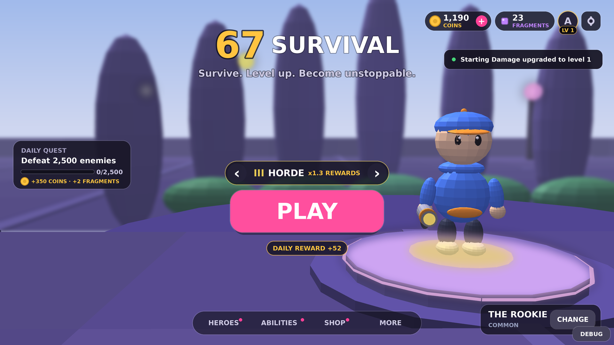

**Хаб** — минимальный, взгляд сразу идёт к **PLAY**. За интерфейсом — живая 3D-сцена: твой герой стоит на подиуме справа (мягкий тёплый свет спереди, холодный контровой сзади, дуга округлых колонн, далёкий светящийся «67» в глубине резкости, несколько медленно парящих огоньков), дышит и машет руками, а камера чуть-чуть «плывёт». Центральная колонка:
* **логотип 67 SURVIVAL** и короткий подзаголовок («Survive. Level up. Become unstoppable.»);
* свободное пространство;
* пилюля **сложности** `‹ III HORDE x1.3 REWARDS ›` — стрелки переключают открытые уровни, нажатие открывает экран сложностей;
* **PLAY** — чуть ниже центра экрана (~61% высоты), большая и чистая; при наведении плавно увеличивается, под ней мягко проступает свечение и тень;
* маленькие чипы, только когда нужны: награда дня, AFK Camp, пати, событие;
* внизу тихая навигация **HEROES · ABILITIES · SHOP · MORE** (точка — есть что открыть или купить).

Сверху справа — монеты, фрагменты, профиль, настройки (уведомления в хабе появляются под ними, не поверх логотипа); слева — маленькая карточка **DAILY QUEST**; справа под 3D-героем — компактная табличка (имя, редкость, лоадаут, CHANGE). Путь: **ГЕРОЙ → СЛОЖНОСТЬ → PLAY**. Камера держит героя в правой трети на любом экране (от 21:9 до телефона), чуть снизу, так что табличка не закрывает героя.

**MORE** — окно-сетка 3×3: ACHIEVEMENTS, COLLECTION, CHALLENGES, AFK CAMP, PARTY, LEADERBOARD, STATISTICS, CODES, CREDITS. Всё второстепенное живёт здесь (настройки — шестерёнка сверху).
**HEROES** — выбор героя большими карточками: 3D-модель, имя, редкость, LOCKED / OWNED / EQUIPPED, пассивка, уникальная механика, стартовая способность, цена во фрагментах; сверху LOADOUT 1/2/3. **ABILITIES** — все способности по категориям, рецепты эволюций, выбор стартовой способности (SET START). **SHOP** — UPGRADES (мета-улучшения за монеты), COSMETICS (12 категорий), BOOSTS, PASSES (+ коды).

| Герои | Коллекция | AFK Camp |
|---|---|---|
| 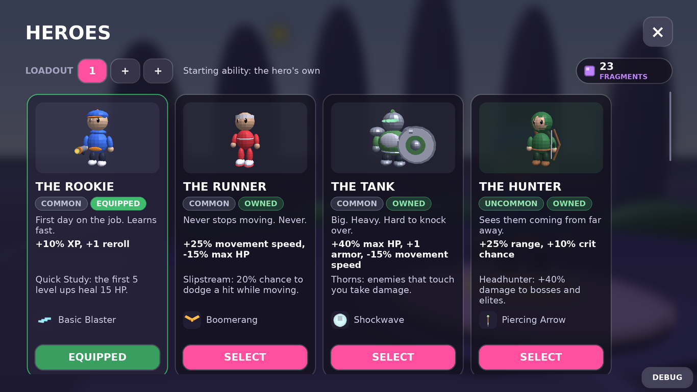 | 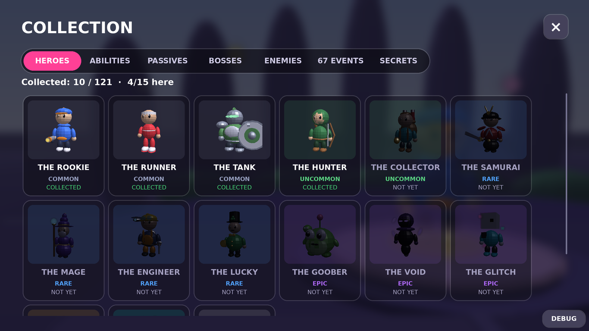 | 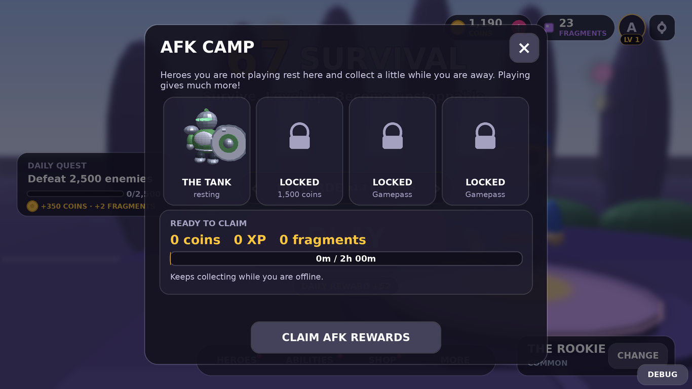 |

| Способности | Косметика | MORE |
|---|---|---|
| 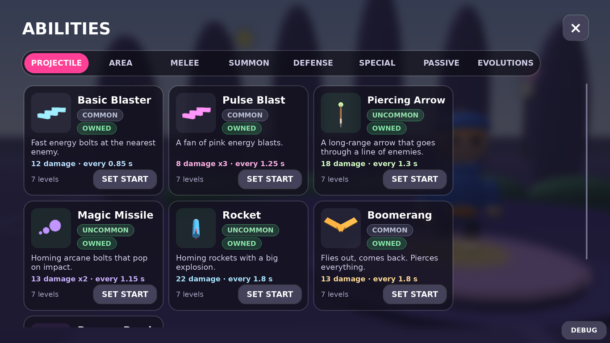 | 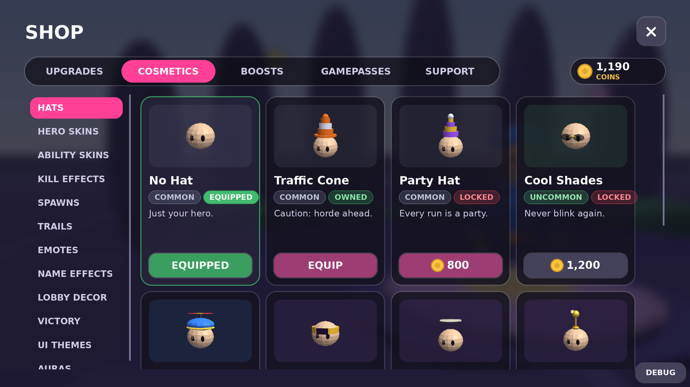 | 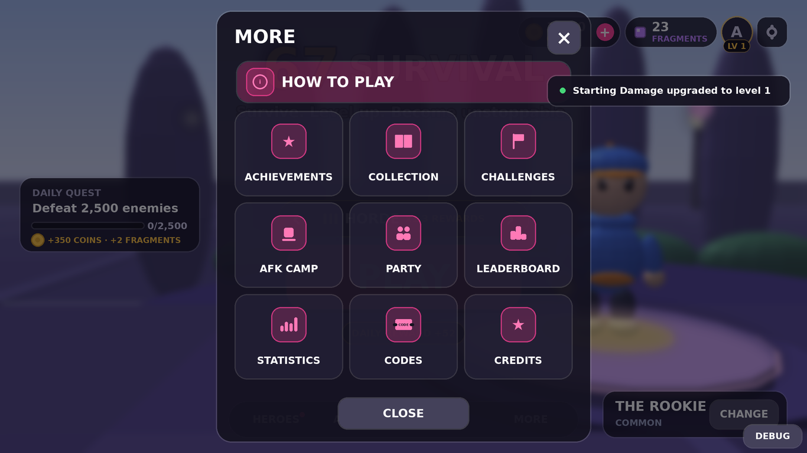 |

**HUD в забеге** — минимум: сверху уровень, тонкая полоска опыта и таймер; слева HP; справа монеты и пауза; полоска босса — только пока жив босс; внизу иконки способностей с уровнем (рамка **EVO** — готова к эволюции, **MAX** — максимум), активные баффы (67%, TURBO, TINY...) и пилюля **EVOLUTION AVAILABLE**. На телефоне иконки справа, подальше от джойстика. Весь билд — в меню паузы.

| HUD с боссом | Эволюция | 67-событие | Итоги |
|---|---|---|---|
| 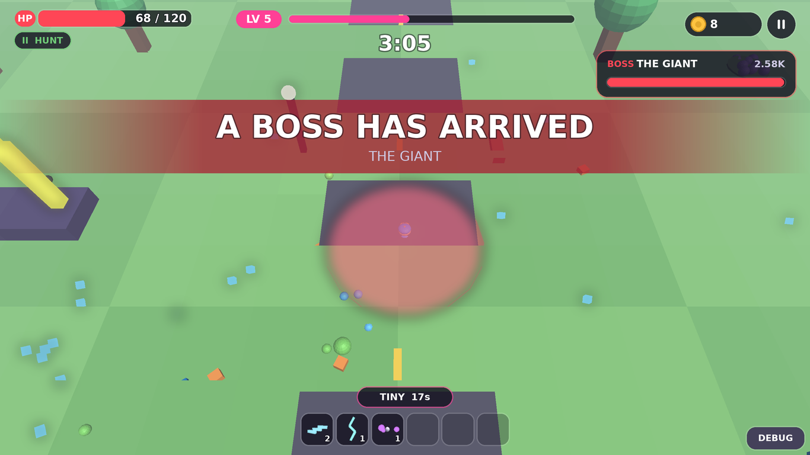 | 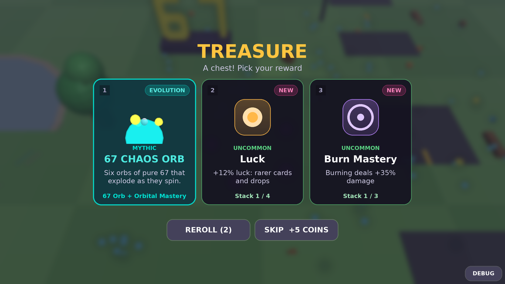 | 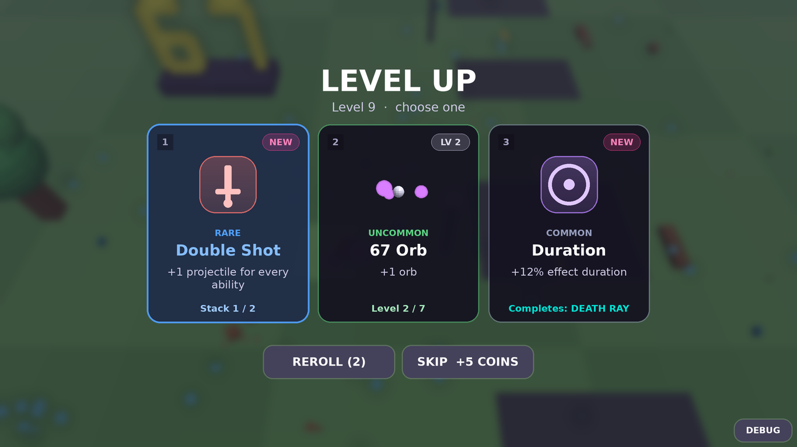 | 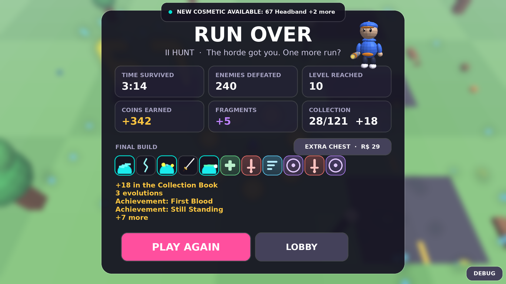 |

**Читаемость героя:** своя модель героя получает белый контур (Highlight, виден сквозь орду) и светящееся кольцо под ногами; враги — без контура, боссы — крупнее и с полоской HP. Все атаки врагов и боссов **телеграфируются** (красные круги, линии, зоны), снаряды врагов — контрастного цвета.

Стиль: тёмные полупрозрачные панели, размытие мира за меню, тонкие границы; белый текст, **один акцент** (розовый: PLAY, опыт, выбранное; меняется косметикой **UI Theme**), **золото** — монеты и награды, **фиолетовый** — фрагменты; красный — только опасность, зелёный — только успех / OWNED / EQUIPPED. Цвета редкостей: Common серый, Uncommon зелёный, Rare синий, Epic фиолетовый, Legendary золотой, Mythic бирюзовый (эволюции), Secret розовый. Шрифты Builder Sans; мемный Luckiest Guy — только логотип «67» и 67-момент. Вместо эмодзи — 3D-превью (ViewportFrame) героев, способностей, врагов и шапок.

**Адаптивность:** всё размечено в единицах 1100×620 и масштабируется `UIScale` (Scale + AnchorPoint + layouts, безопасные отступы). На телефонах в горизонтали — холст 1000×520, элементы крупнее; высокие окна сами ужимаются. Проверено отрисовкой при 1920×1080, 1600×900, 1366×768, планшете 1024×768 и телефоне 844×390 (см. «Тесты»).

| Телефон: хаб | Телефон: забег |
|---|---|
| 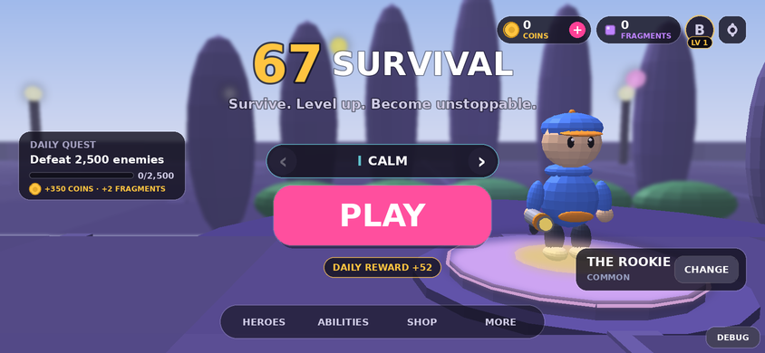 | 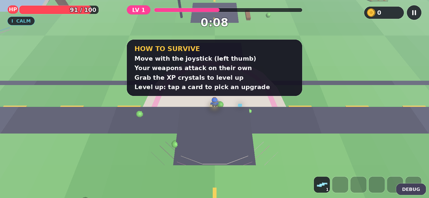 |

## Карта: 67 PARK
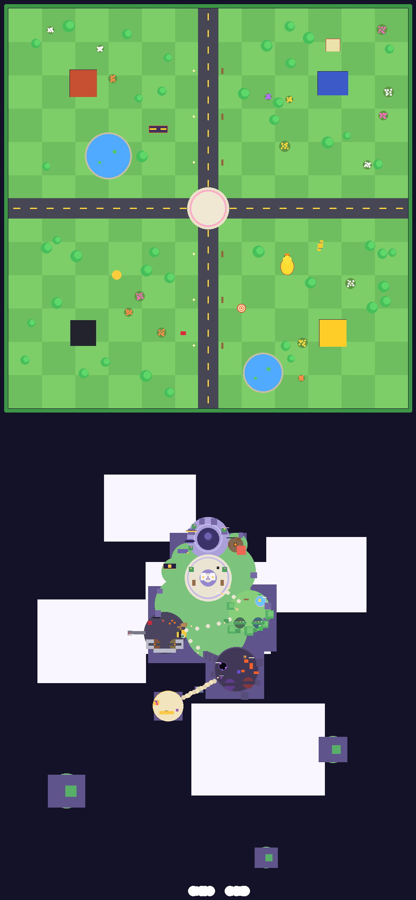

Арена 480×480 студов: открытый центр для орды, крупная «шахматка» травы и дороги с разметкой (движение хорошо читается с камеры сверху), четыре здания (HORDE MART, HERO GYM, 67 CASINO, 67 DINER), деревья, пруды и клумбы, ориентиры: монумент «67» из неоновых сегментов, резиновая утка, парящая сфера, конус, огромная статуя, которая всегда смотрит в центр, автомат со снеками. Враги обходят здания, деревья и объекты (атрибут `EnemyBlocker`). **Пруды — это вода** (атрибут `Water`): в ней и герой, и орда идут на 75% скорости (`GameConfig.Water`; боссов и летающих вода не замедляет).
**Лобби:** **сцена хаба** на точке появления (подиум героя, дуга колонн, живая изгородь, «67» вдали, свет), портал PLAY, доска рекордов, **AFK CAMP** (костёр, скамейки: встань на площадку — откроется окно лагеря) и трава с табличкой «DO NOT TOUCH». Базовое освещение задаёт `MapBuilder` (лёгкая дымка Atmosphere, мягкий Bloom для неона, аккуратная цветокоррекция).
Картинку можно перерисовать после правок карты: `lune run tools/export_map.luau && python3 tools/render_map.py` (нужен Pillow).

## Забег (10–15 минут)
| Время | Что происходит |
|---|---|
| 0:00 | старт, Goober |
| 0:25 | + Skitter (стаями) |
| 0:55 | **HERE THEY COME**: кольцо губеров вокруг игрока, + Husk |
| 1:30 | + Charger |
| 2:05 | **NEW ENEMIES**: Spitter, Splitter, Bomber |
| 3:00 | ⚠ **босс 1: THE GIANT или THE GOOBER** |
| 3:45 | + Blinker |
| 4:20 | **THE HORDE GROWS**: Brute, Diver, Leaper, Summoner |
| 5:40 | стена Charger |
| 6:00 | ⚠ **босс 2: THE GLITCH или THE MACHINE** |
| 7:00 | **SNIPERS**: + Sniper, Ghost, Mimic |
| 9:00 | ⚠ **босс 3: THE VOID или THE OVERLORD** |
| 10:00 | **EXTREME PHASE** |
| 12:00 | ⚠ **THE FINAL ONE** → убил = **VICTORY** |
| 14:00+ | OVERTIME: орда без предела |

Перед боссом — предупреждение «A BOSS HAS ARRIVED» (перед финальным — «THE END IS HERE»), облёт камеры и полоска HP; босс оставляет сундук, фрагменты и расчищает поле вокруг. Каждый level up лечит 8 HP. Стрелки у края экрана показывают босса, сундуки, фрагменты и редких врагов, когда они вне экрана.
Здоровье и урон врагов растут со временем (`WaveData.HPScale / DamageScale`). Если врагов мало, спавн ускоряется (`MinAlive`), отставших переносит вперёд — орда никогда не «рассасывается». После 2:30 изредка появляются **элитные** враги (кольцо, ×4 XP, шанс фрагмента).

## Герои (15)
Каждый герой — отдельная стилизованная модель (не стандартный персонаж Roblox) с узнаваемым силуэтом, своим оружием, характерным аксессуаром и цветовым акцентом, своей стартовой способностью, пассивкой и уникальной механикой.

**Визуальный язык моделей — «smooth + clean + minimal»:** тело, голова, руки и ноги — гладкие эллипсоиды (Part + SpecialMesh Sphere), детали — шары и цилиндры, острые грани только там, где это и есть дизайн (клинок катаны, экран THE 67, кубическая голова THE GLITCH). Пропорции «игрушечные»: крупная голова с блестящими глазами, компактное тело. Материалы: SmoothPlastic, Metal (оружие, броня, золото), Glass (линзы, визоры) и Neon **только для энергии** (сфера посоха, пламя, визор, экран «67»), не больше 6 неоновых деталей на героя. Руки и ноги — на Motor6D: при ходьбе они шагают и машут в такт, в покое герой дышит, эмоции получили позы (настоящий взмах рукой, «флекс», жест «6 7» ладонями). Шапка-косметика заменяет собственный головной убор героя (кепку, шляпу, каску), а не надевается поверх.

| Герой | Редкость | Старт | Пассивка | Механика | Открытие |
|---|---|---|---|---|---|
| THE ROOKIE | Common | Basic Blaster | +10% XP, +1 reroll | первые 5 level up лечат 15 HP | сразу |
| THE RUNNER | Common | Boomerang | +25% скорость, −15% HP | 20% шанс увернуться в движении | сразу |
| THE TANK | Common | Shockwave | +40% HP, +1 броня, −15% скорость | шипы: касание ранит врагов | сразу |
| THE HUNTER | Uncommon | Piercing Arrow | +25% дальность, +10% крит | +40% урона боссам и элите | 15 фрагментов |
| THE COLLECTOR | Uncommon | Sigma Aura | +60% магнит, +25% монет | XP +15%, монеты падают на 50% чаще | 15 |
| THE SAMURAI | Rare | Katana | +15% площадь, +10% урон | каждый 4-й удар ×3 и шире | 40 |
| THE MAGE | Rare | Magic Missile | −10% кулдауны | +1 снаряд у ракет и болтов | 40 |
| THE ENGINEER | Rare | Drone | +10% длительность | +1 дрон, дроны +25% урона | 40 |
| THE LUCKY | Rare | Lightning | +50% удача | 67-события чаще, сундуки +1 карта | 40 |
| THE GOOBER | Epic | Pulse Blast | +10 HP | 2 помощника со старта, +1 каждые 10 уровней | 70 |
| THE VOID | Epic | Orbital Blades | +5% урон | быстрые убийства: +1% урона (до +40%) | 70 |
| THE GLITCH | Epic | Laser | +10% скорость | вместо удара — телепорт (раз в 5 с) | 70 |
| THE OVERDRIVE | Legendary | Rocket | +5% скорость атаки | до +60% скорости атаки при низком HP | 110 |
| THE 67 | Mythic | 67 Orb | +6.7% урон и XP, +67% удача | каждое 67-е убийство — бесплатный 67 BLAST; 67-события ×3 | 167 или «Seen It All» |
| THE UNKNOWN | **Secret** | Chain Lightning | +15% ко всему | 2 случайные способности и 1 revive | победить THE 67 |

Выбор стартовой способности (ABILITIES → SET START) и **лоадауты** (герой + способность, слоты 2–3 — с пассом) — в меню героев.

## Сложность (7 уровней)
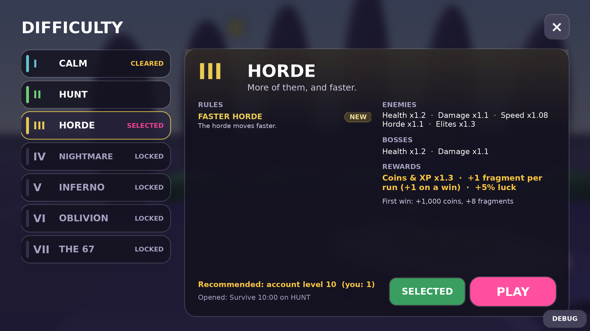

Перед забегом: **ГЕРОЙ → СЛОЖНОСТЬ → PLAY**. Экран **DIFFICULTY** — «лестница» уровней слева и подробности справа: описание, **правила** (новые помечены NEW), что получают враги и боссы, награды, рекомендуемый уровень аккаунта, условие открытия с прогрессом, кнопки SELECT и PLAY. Цвет каждого уровня — только в акцентах (цифра, полоска, лёгкий оттенок): от спокойного бирюзового до напряжённого красного и золота; в самом забеге картинку слегка тонирует настроение уровня, а в HUD под HP — плашка уровня.

| Уровень | Враги (HP / урон / скорость) | Боссы (HP / урон) | Орда · элита | Награды | Правила | Открывается |
|---|---|---|---|---|---|---|
| **I CALM** | ×0.7 / ×0.6 / ×1 | ×0.65 / ×0.6 | ×1 · ×0.5 | ×0.9 | — | сразу |
| **II HUNT** (классика) | ×1 / ×1 / ×1 | ×1 / ×1 | ×1 · ×1 | ×1 | — | победить босса на CALM |
| **III HORDE** | ×1.2 / ×1.1 / ×1.08 | ×1.2 / ×1.1 | ×1.1 · ×1.3 | ×1.3, +1 фрагм., +5% удачи | FASTER HORDE | продержаться 10:00 на HUNT |
| **IV NIGHTMARE** | ×1.5 / ×1.25 / ×1.1 | ×1.45 / ×1.2 | ×1.2 · ×2.5 | ×1.6, +2, +10% | + ELITE INVASION, BOSS RAGE | победа на HORDE |
| **V INFERNO** | ×1.9 / ×1.4 / ×1.12 | ×1.8 / ×1.3 | ×1.3 · ×3 | ×2, +3, +15% | + CHAOS, GLITCH | победа на NIGHTMARE |
| **VI OBLIVION** | ×2.4 / ×1.6 / ×1.15 | ×2.2 / ×1.45 | ×1.4 · ×3.5 | ×2.5, +4, +20% | + LOW XP, NO MERCY | победа на INFERNO |
| **VII THE 67** | ×3 / ×1.8 / ×1.18 | ×2.7 / ×1.6 | ×1.5 · ×4 | ×3.2, +6, +30% | + 67 CHAOS | победа на OBLIVION |

HUNT — это ровно прежняя игра (те же сиды дают те же забеги), экономика классики не изменилась. Баланс проверен ботом (`tests/sim.luau … <уровень>`, герой с максимальной метой, 8 сидов): среднее время жизни I→VII — 15:08, 11:30, 9:01, 8:00, 7:33, 6:28, 5:48; кривая ровная, без обрывов. Бот играет заметно хуже человека (даже на HUNT побеждает ~1 раз из 8), поэтому верхние уровни — первый проход, их числа удобно подкрутить в `shared/DifficultyData.lua`.

**Правила:** FASTER HORDE — орда быстрее · ELITE INVASION — элита с 1:30 и намного чаще · BOSS RAGE — боссы сразу с атаками ярости и впадают в ярость раньше (70% HP) · CHAOS — 67-события чаще плюс случайные «сюрпризы арены» · GLITCH — каждые 10–14 с часть орды глитчем появляется рядом · LOW XP — −15% опыта · NO MERCY — короче замахи (телеграфы укорачиваются вместе с ними — всё честно), быстрее выстрелы, плотнее орда · 67 CHAOS — 67-события длятся дольше, лут удваивается, THE 67 и 67 BOSS чаще.

**Награды:** множитель монет и опыта аккаунта; с HORDE — фрагменты за каждый забег от минуты и ещё раз за победу; удача (редкие карты, дроп, фрагменты с элиты); **бонус первого прохождения** каждого уровня (300…6700 монет, 3…30 фрагментов); достижения за победу на II–VII с косметикой (Horde Ribbon, Nightmare Shatter, Inferno Crown, Oblivion skin, **Crown of 67** — секретная шапка) и **титулы** на табличке над героем (Nightmare Walker, Inferno Walker, Beyond Oblivion, THE 67). Высокие уровни **не нужны** для обычного прогресса: героев, способности и улучшения можно открыть на любом уровне. В пати играют на уровне лидера. Старые профили ничего не теряют: всё, что было пройдено до сложностей, считается уровнем HUNT.

## Способности (30 + 12 эволюций)
Все атакуют сами, 7 уровней. Редкость влияет на шанс выпасть в карточках.

| Категория | Способности |
|---|---|
| **PROJECTILE** | Basic Blaster · Pulse Blast · Piercing Arrow · Magic Missile · Rocket · Boomerang · Banana Bomb |
| **AREA** | Sigma Aura · Fire Ring · Ice Field · Poison Cloud · Meteor · Shockwave · Lightning · Chain Lightning · Laser · Black Hole |
| **MELEE** | Katana · Giant Fist · Sword Storm · Orbital Blades |
| **SUMMON** | Drone · Clone · Goober Friends |
| **DEFENSIVE** | Barrier · Glitch |
| **SPECIAL** | 67 Orb · Chaos · 67 Blast (Legendary) · Sigma Stare (Secret) |
| **PASSIVE** (22) | Power, Rapid Fire, Expansion, Swiftness, Wisdom, Magnet, Vitality, Regeneration, Greed, Duration, Crit Master, Armor, Luck, Vampire, Berserk, Orbital Mastery, Burn Mastery, Double Shot, Execution, XP Storm, **67%** (Legendary), Touch Grass (Secret) |

18 способностей открыты сразу, остальные — за фрагменты (12 / 25 / 40) или достижение; Sigma Stare и Touch Grass — секреты.

### Эволюции
Способность на **максимальном уровне** + нужная пассивка → на экране **EVOLUTION AVAILABLE**, а следующий level up (или сундук) первой карточкой предлагает эволюцию (Mythic, с бирюзовой рамкой). Карточки пассивок, которые завершают рецепт, подсвечены («Evolves Katana»). Рецепты видны в ABILITIES.

| База | + пассивка | → эволюция |
|---|---|---|
| Basic Blaster | Rapid Fire | **OVERDRIVE BLASTER** — непрерывный поток пробивающих болтов |
| 67 Orb | Orbital Mastery | **67 CHAOS ORB** — шесть взрывающихся сфер |
| Fire Ring | Burn Mastery | **INFERNO RING** — всё вокруг горит |
| Chain Lightning | Crit Master | **STORM CALLER** — бесконечные цепи молний |
| Katana | Berserk | **BLOOD MOON** — круговые удары с вампиризмом |
| Drone | Double Shot | **DRONE SWARM** — шесть дронов |
| Black Hole | Magnet | **SINGULARITY** — две воронки, притягивают XP |
| Magic Missile | Wisdom | **ARCANE STORM** — шторм самонаводящихся ракет |
| Rocket | Expansion | **NUKE LAUNCHER** — очень большой взрыв |
| Boomerang | Swiftness | **CYCLONE** — пять огромных бумерангов |
| Ice Field | Armor | **ABSOLUTE ZERO** — враги внутри замерзают |
| Laser | Duration | **DEATH RAY** — два бесконечных луча |

## Level up
Игра останавливается, 3 карточки: новая способность, уровень способности, пассивка или эволюция. Редкости: **Common → Uncommon → Rare → Epic → Legendary → Mythic → Secret**; Legendary выпадает редко (удача немного поднимает шанс), Mythic — только эволюции, Secret — только после находки секрета. Reroll и Skip (+5 монет). Сундуки боссов — «TREASURE» с повышенным шансом редких карт, **67 CHEST** — +1 карта и больше удачи.

## 67-события (8)
Редкие, не во время боссов, не повторяются подряд. Затемнение → «6»… «7»… → **«67»** (мемный шрифт, зум камеры) → название события. В пати событие лидера видят все.

| Событие | Что происходит |
|---|---|
| **67% EVENT** | +67% урона, +67% XP, +67% врагов |
| **67 CHEST** | появляется золотой сундук — добеги |
| **67 INVASION** | вся орда разом (лимит врагов почти ×2), но враги слабее |
| **67 LUCK** | редкие карты и дроп повсюду, 67-гоблин, ящики |
| **67 CHAOS** | каждые 2.5 с что-то случайное |
| **67 MODE** | TINY (враги на 67% меньше) / TURBO (всё на 67% быстрее) / GLASS (×2 урон в обе стороны) / GIANT (огромные враги, ×2 XP) |
| **67 BOSS** | появляется **THE 67 KING** |
| **THE 67** | очень редкий враг кружит вокруг и бросается шестёрками и семёрками; убей, пока не ушёл |

Пассивка `67%` гарантирует 67-событие через несколько секунд. Герои THE 67 и THE LUCKY видят события чаще; по выходным (**67 WEEKEND**) события в 2 раза чаще.

## Враги (15 + редкие)
| Враг | Поведение |
|---|---|
| **Goober** | слабый, толпой |
| **Skitter** | крошечный, быстрый, стаями |
| **Husk** | медленный, пустой взгляд |
| **Charger** | останавливается, топает и таранит по прямой |
| **Spitter** | держит дистанцию и плюётся слизью |
| **Splitter** | делится на трёх при смерти |
| **Bomber** | бежит с горящим фитилём — красный круг взрыва (ранит и врагов) |
| **Blinker** | телепортируется ближе |
| **Brute** | огромный, медленный, почти не отбрасывается |
| **Diver** | кружит сверху, потом пикирует по линии |
| **Summoner** | держится сзади и призывает скиттеров |
| **Ghost** | исчезает: в это время не бьёт и неуязвим |
| **Leaper** | прыгает туда, где ты был (круг приземления) |
| **Mimic** | притворяется ящиком с лутом |
| **Sniper** | красная линия прицела → выстрел по ней |
| **67 Goblin** (редкий) | убегает с мешком монет |
| **THE 67** (очень редкий) | см. 67-события |
| **Golden Goober** (секрет) | 1 из 500 губеров золотой |
| **Loot Box** | снеки, магнит, бомба, монеты |

## Боссы (8)
Каждый: предупреждение, полоска HP, телеграфы всех атак, ярость на 50% HP, награда (сундук, фрагменты).

| Босс | Когда | Атаки |
|---|---|---|
| **THE GIANT** | 3:00 | удары по земле, ударные волны, призыв хасков |
| **THE GOOBER** | 3:00 | прыгает на тебя, дождь из губеров |
| **THE GLITCH** | 6:00 | телепорт рядом, лазерные линии через арену, распад на блинкеров |
| **THE MACHINE** | 6:00 | залпы ракет, лазеры, кольца пуль |
| **THE VOID** | 9:00 | зоны пустоты под ногами, спирали тёмной энергии |
| **THE OVERLORD** | 9:00 | рывки через арену, кольца, призыв плевунов |
| **THE 67 KING** | 67 BOSS | двойной удар «6-7», спирали, 67-сундук |
| **THE FINAL ONE** | 12:00 | всё сразу; победа = VICTORY |

## Секреты
Найденные секреты открываются в Collection Book (до этого — «???»).
* **SECRET 67**: быть 6 или 7 уровня ровно в 1:07 → бесплатная карта `67%`
* **SIGMA STARE**: стоять неподвижно 6.7 с в орде → враги замирают; открывает секретную способность
* **Touch Grass**: потрогай траву в лобби → секретная пассивка
* **No-Clip**: в арене есть комната, в которую можно пройти сквозь стену
* **Golden Goober**, **1 HP Club** (5 секунд на 1–2% HP), **Untouchable** (3 минуты без урона)
* **It Was Real**: победить THE 67 → секретный герой THE UNKNOWN

## Мета-прогрессия и удержание (без манипуляций)
* **Три валюты** (подписаны рядом со значком; у фрагментов — подсказка, откуда они): **монеты** (улучшения, косметика, слоты AFK), **фрагменты** (герои и способности: 2 за каждый забег дольше минуты + 1 за каждые 3 минуты + 2 с каждого босса, элита, ежедневные квесты 1–2, достижения, челленджи, AFK; первый платный герой за 15 — примерно за 2–3 забега новичка), **XP аккаунта** (уровень и титулы: Rookie → Survivor → Horde Breaker → Veteran → Unstoppable → Legend → THE 67)
* **Постоянные улучшения** (13): урон, HP, скорость, XP, монеты, магнит, броня, реген, удача, reroll, revive, +1 стартовая способность, +слот способностей. Первый уровень дешёвый (50–80 монет), Revival и +1 стартовая способность — большие цели (2 500 / 3 000)
* **Collection Book** (MORE → COLLECTION): 121 запись — герои, способности, пассивки и эволюции, боссы, враги, 67-события, секреты; «Collected: X / Y», неоткрытое — силуэт и «???». Награды за 25 / 60 / 100 записей
* **36 достижений** (7 секретных) с монетами, фрагментами и открытиями · **ежедневная награда** (серия 7 дней) · **ежедневный квест** · **3 недельных челленджа** (монеты + фрагменты, сброс в понедельник)
* **Ограниченные по времени события** (по дате UTC): 67 WEEKEND (суббота–воскресенье: 67-события ×2, +20% фрагментов), GOLD RUSH (пятница: +25% монет), BOSS WEEK (первая неделя месяца: +1 фрагмент с босса)
* **Рекорды**: лучшее время и уровень (плашка BEST в итогах), больше всего эволюций за забег · **Статистика** · **Профиль** · **Лидерборды** (уровень, время, убийства, боссы, монеты, коллекция) + доска в лобби
* **Коды** (MORE → CODES): каждый работает один раз на игрока, проверяет сервер; список — `src/server/Data/Codes.lua` (67, SURVIVE, HORDE, FRAGMENTS, RELEASE)

### AFK Camp
Герои, которыми ты сейчас не играешь, отдыхают в лагере и понемногу приносят монеты, XP и фрагменты — даже офлайн. **Лимит 2 часа** (4 с пассом), потом лагерь «полон», пока не нажмёшь **CLAIM AFK REWARDS**. Слоты: 1 бесплатно, 2-й и 3-й за монеты (1 500 / 5 000), 4-й — пасс. Игра всегда даёт намного больше, чем AFK.

## Социальное
* **Пати до 4 игроков** (MORE → PARTY): приглашение, JOIN / NO, выгнать / выйти. Любой в пати жмёт PLAY → стартуют все, кто в лобби; игроки появляются рядом, 67-события лидера видят все. +10% монет и XP за каждого участника (до 3)
* **Бонус друзей**: +5% за каждого друга на сервере (до 3)
* **Цель сервера**: 6 700 убийств всеми игроками → +67 монет каждому (MORE → CHALLENGES)
* Эмоции (`G`), косметика видна другим в лобби и на арене

## Монетизация (только косметика и удобство, не pay-to-win)
**Косметика** (68 предметов, 12 категорий): шапки, скины героя, скины способностей, эффекты убийства, эффекты появления, трейлы, эмоции, эффекты ника, декор лобби, анимации победы, темы интерфейса, ауры. Источники: монеты, достижения, уровень аккаунта, коллекция, пассы. Новое — плашка **NEW COSMETIC AVAILABLE**, без всплывающих «купи сейчас».
**Game Passes:** VIP Cosmetics · Cosmetic Collection · Extra Loadout Slots · Extra AFK Hero Slot · AFK Capacity.
**Developer Products:** Revive (1 раз за забег) · Extra Reroll · Extra Chest (после забега) · 67 Aura (косметика на 30 минут) · AFK Boost (×2 AFK на 4 часа).
**SUPPORT (донаты):** SHOP → SUPPORT — Say Thanks · Big Thanks · Legendary Supporter. Никакой награды в игре: спасибо и счётчик в профиле (`Stats.Supported`, `Stats.SupportedRobux`), можно покупать сколько угодно раз.

**Как включить продажу за Robux в опубликованной игре** (код покупок, владения, чеков и компенсаций уже готов, нужны только ID):
1. Опубликуй место (File → Publish to Roblox) и открой его на create.roblox.com → Creations.
2. **Monetization → Passes:** создай пасс на каждую строку `Passes` в `src/shared/MonetizationData.lua` (название, картинка, цена), выставь на продажу, скопируй ID (число в ссылке) в поле `Id`.
3. **Monetization → Developer Products:** то же для каждой строки `Products` (включая 3 SUPPORT).
4. Пересобери (`tools/verify.sh` или `rojo build`) и опубликуй снова.

Цены в игре берутся из Roblox (`MarketplaceService:GetProductInfo`), поэтому надпись на кнопке всегда совпадает с ценой в панели; `Price` в файле — только запасной вариант. С `Id = 0` товар в опубликованной игре виден как **SOON** и не покупается, а в Studio покупка симулируется, чтобы проверить каждую награду. При старте сервер пишет в Output список товаров без ID. `ProcessReceipt` идемпотентен и сохраняет профиль перед `PurchaseGranted`; если продукт не может примениться, игрок получает компенсацию монетами.

---

## Архитектура

```
default.project.json
src/shared → ReplicatedStorage.Modules
  GameConfig          все числа: симуляция, арена, игрок, XP-кривая, награды, AFK, пати, сохранения
  HeroData HeroModels 15 героев: статы, механики и модели из частей (одна сборка для игры и превью)
  WeaponData UpgradeData Rarity   способности, эволюции, пассивки, редкости и их веса
  EnemyData WaveData  враги, боссы, таймлайн, 67-события
  MetaData AchievementData CosmeticData CollectionData LiveEvents MonetizationData
  Stats               бонусы → итоговые статы игрока и способностей (общие для сервера и UI)
  Protocol            бинарный формат кадра забега (buffer)
  Net                 список RemoteEvents (создаются в ReplicatedStorage.Remotes)
src/server → ServerScriptService.Server
  Main.server         Init() → Start() всех сервисов
  Sim/                ЧИСТАЯ симуляция забега, без Instance (тестируется офлайн)
    Run               состояние забега, механики героев, эволюции, шаг, кадр, итоги
    EnemyManager      спавн, 15 поведений, толпа, препятствия, контактный урон, смерть и дроп
    CombatManager     все способности, снаряды, зоны, союзники, урон (крит, 67%, горение)
    WaveManager       таймлайн, всплески, боссы, 67-события, секреты
    Bosses            атаки боссов с телеграфами, ярость, награды
    Pickups           XP-кристаллы (слияние при лимите), сундуки, фрагменты, предметы
    LevelUp           карточки (редкость, эволюции) и их применение
    SpatialGrid       хеш-сетка для поиска соседей
  Services/
    GameManager       забеги игроков и пати, ОДИН Heartbeat на всех, кадры, remotes забега, античит
    DataManager       DataStore: pcall + retry + backoff + session lock + autosave + BindToClose
    PlayerManager     сессии, снапшот профиля для UI, настройки, ежедневные и недельные задания
    RewardManager     монеты, фрагменты, XP, статистика, коллекция, квесты, достижения, секреты
    AfkManager        AFK Camp: накопление с лимитом, слоты, claim
    PartyManager      пати, приглашения, друзья, цель сервера
    ShopManager       улучшения, герои, способности, лоадауты, косметика, коды
    CharacterManager  модель героя на персонаже (Motor6D), ник, трейл, аура, эмоции, декор
    MapBuilder        строит лобби (с AFK Camp) и арену кодом (если в Workspace нет своей Map)
    LeaderboardManager  OrderedDataStore + доска в лобби
    MonetizationManager passes / products / ProcessReceipt
    AdminManager      команды отладки
  Data/Defaults       схема профиля (v2) + миграция + Reconcile (чинит любые данные)
  Util/Guard          rate limit + pcall + проверки типов для всех remotes
src/client → StarterPlayerScripts.Client
  Main.client         Init() → Start() контроллеров
  Controllers/
    RunClient         декодирует кадры, интерполяция врагов, раздаёт события
    HeroAnimator      анимация моделей героев (ходьба, idle, эмоции), контур своего героя
    EnemyRenderer     пулы моделей, ОДИН BulkMoveTo на всех врагов за кадр
    PickupRenderer    кристаллы, сундуки, фрагменты, союзники
    WeaponFx          визуал способностей и эволюций, снаряды врагов, телеграфы
    EffectsController цифры урона, частицы, эффекты убийства и появления, 67-момент
    CameraController  камера сверху, тряска, зум-панчи, облёт босса
    HudController LevelUpController BannerController ResultsController LobbyController
    PointerController SoundController InputController WorldController DebugController ClientData
  Render/             EnemyModels (26 моделей из частей + варианты: элита, золото, мини), Pool
  UI/                 Theme (палитра, редкости, темы), Kit, Widgets, Cards, Previews (3D-превью), Icons,
                      Panels/* (16 меню: Kind = "Screen" на весь экран или "Window")
tests/                офлайн-тесты (Lune)
```

### Производительность
* **Сервер симулирует врагов как данные**, без Humanoid и физики: фиксированный шаг 20 Гц, хеш-сетка для поиска соседей, коллайдеры карты в грубой сетке. **Один Heartbeat** на все забеги сервера; при лаге время пропускается, а не копится.
* **Сеть:** один бинарный `buffer` 10 раз в секунду (позиции int16 с точностью 1 см, только сдвинувшиеся враги). Редкие события (карточки, баннеры, итоги) — отдельный reliable-remote пачкой.
* **Клиент рисует всё сам:** модели врагов из пулов (корень anchored + приваренные части), позиции интерполируются и ставятся **одним `workspace:BulkMoveTo`**. Пулы обрезаются между забегами.
* **Лимиты:** 260 врагов на забег (440 во время 67 INVASION), 1300 на сервер (делятся между забегами), 180 кристаллов (лишний XP вливается в соседние), 24 предмета (сундуки и фрагменты не вытесняются), 120 снарядов, 70 снарядов врагов, 12 зон, 8 союзников, 90 цифр урона на кадр.
* Настройка **Low quality** уменьшает частицы и отключает анимацию смерти для слабых телефонов.
* **Hero outline** (по умолчанию включён): в забеге у твоего героя контур и лёгкое свечение (Highlight поверх всего — виден сквозь орду). **Fewer effects**: частиц втрое меньше, без кувырков убитых, зоны и ауры способностей прозрачнее (телеграфы атак врагов не трогаются). Числа — `GameConfig.Visuals`.
* **Иконки** характеристик, улучшений, товаров и косметики: `src/client/UI/IconImages.lua` (id → `rbxassetid://…`, сейчас все пустые). Пока картинки нет, рисуется заглушка единого стиля — плитка цвета категории с символом (меч, линии скорости, кольцо, крест, щит, столбики, монета, звёздочка).

### Анти-эксплойт
Сервер решает всё: урон, XP, монеты, фрагменты, смерти врагов, награды, AFK-накопления (по серверному времени), прогрессию. Клиент отправляет только намерения («начать забег», «выбираю карточку 2», «герой в слот 1 лагеря»), каждое проверяется по типу, частоте и состоянию. Позиция игрока берётся с персонажа, но **симуляция не двигается быстрее скорости ходьбы**, а при долгом расхождении персонаж возвращается. Покупки — только в лобби.

### Своя карта
Положи в Workspace модель `Map` с `Arena` и `Lobby`: части с атрибутом `EnemyBlocker = true` станут препятствиями для врагов, `SecretRegion = "<ключ>"` — секретными зонами, `PlayPortal = true` — порталом запуска, `AfkCamp = true` — площадкой лагеря; точки спавна — `Workspace.SpawnPoints` (`Lobby`, `Arena1..N`).

---

## Тесты
Нужны [Lune](https://lune-org.github.io) 0.8, Rojo 7 и (для типов) luau-lsp. Всё сразу: `tools/verify.sh` (с `ROBLOX_TYPES=путь/к/globalTypes.d.luau`).

| Тест | Что проверяет |
|---|---|
| `lune run tests/run.luau` | данные (герои и их модели, способности, эволюции, редкости, враги, таймлайн, достижения, косметика, коллекция, 7 уровней сложности и цепочка открытия), масштабирование забега по сложности, протокол, статы, починка и миграция сохранений, карточки level up, сетка, первые минуты каждого героя |
| `lune run tests/e2e.luau` | **настоящие серверные и клиентские скрипты** в офлайн-движке: лобби, модели всех 15 героев, все 16 меню, PLAY, враги и автоатака, level up, босс, все 8 67-событий, каждый вид способностей и эволюция, смерть → итоги → награды, выбор и замки сложностей, магазин, косметика (крутящиеся шапки), AFK Camp, пассы и продукты, пати, эксплойты, сохранение → выход → перезаход, мобильный клиент |
| `lune run tests/soak.luau` | два полных забега подряд до VICTORY: лимиты, размер кадров, пулы, отсутствие роста инстансов |
| `lune run tests/sim.luau [сидов] [герой] [скилл] [минут] [мета] [сложность]` | баланс: бот играет забеги (уворачивается от телеграфов, берёт эволюции), лог по минутам, бои с боссами, события |
| `tools/ui_check.sh [сцены]` | **визуальная проверка UI**: настоящие скрипты проходят хаб с 3D-сценой (софтверный рендер мира: свет, туман, глубина резкости), все меню, забег с боссом, 67-событие, level up с эволюцией, паузу, смерть, итоги и телефон; дерево GUI раскладывается как в Roblox и рисуется в PNG при 5 разрешениях (`build/ui/png`), с отчётом: текст, который сильно ужимается, элементы за краем экрана, наложения. Нужен Pillow |
