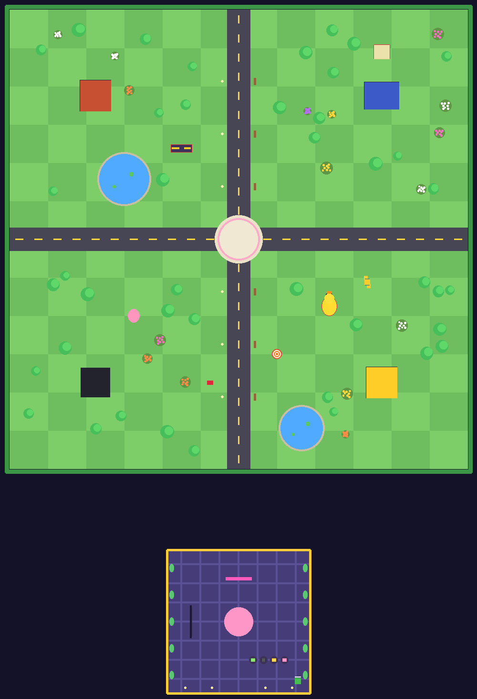

# 🧠 BRAINROT SURVIVORS

> Roblox survivor-like: **ДВИГАЙСЯ → ВЫЖИВАЙ → LEVEL UP → ВЫБИРАЙ → СТАНОВИСЬ СИЛЬНЕЕ**.
> Оружие стреляет само, орда растёт каждую минуту, боссы на 5:00, 10:00 и 13:00, победа над THE FINAL GOOBER.
> 70–80% — нормальная survivor-игра, 20–30% — brainrot: 67, sigma, goofy NPC, редкие мем-события.

Рядом лежат две другие игры репозитория: [The Doppelgänger Obby](../README.md) и [Chile Simulator](../ChileSimulator/README.md).

---

## Как запустить

### ▶ Самый простой способ — один файл
В **корне репозитория** лежит `BrainrotSurvivors.rbxlx` — в нём вся игра (карта, скрипты, интерфейс). Двойной клик по нему (или по `PLAY_BrainrotSurvivors.bat` / `.command` рядом) → откроется Roblox Studio → нажми **Play (F5)**. Ничего скачивать и собирать не нужно.

### ▶ Одной кнопкой со сборкой из исходников
* **Windows:** двойной клик по `PLAY.bat` · **macOS:** `PLAY.command` (первый раз: правый клик → «Открыть»)

Скрипт сам скачает Rojo (один раз, в `tools/`), соберёт игру из `src/` и откроет её в Roblox Studio. Дальше — **Play (F5)**.

### Готовый файл
`BrainrotSurvivors.rbxlx` (здесь и в корне репозитория) → открыть в Studio → **Play**.
Лучше всего тестировать через **Test → Clients and Servers** или на телефоне через **Device Emulator**.

### Разработка через Rojo
`rojo serve` в этой папке → плагин Rojo в Studio → **Connect**. Пересборка: `rojo build default.project.json -o BrainrotSurvivors.rbxlx`.

### Сохранения в Studio
*Game Settings → Security → Enable Studio Access to API Services* (место должно быть опубликовано). Без этого игра работает в режиме памяти и пишет об этом в лобби и в настройках.

### Управление
| | Движение | Карточки level up | Пауза |
|---|---|---|---|
| ПК | WASD / стрелки, колесо — зум | клик или `1`–`4`, `R` — reroll | `Esc` / `P` |
| Телефон / планшет | виртуальный джойстик (Roblox Thumbstick), щипок — зум | тап | кнопка `II` |
| Геймпад | левый стик | `A` `X` `Y` `B`, `RB` — reroll | `Start` |

**Атака полностью автоматическая.** Прыжок в арене выключен, поэтому на телефоне нет лишних кнопок.

### Отладка
В Studio (и для `GameConfig.AdminUserIds` / владельца места) внизу справа кнопка **DEBUG**: +1 минута, сразу к боссам (4:55 / 9:55 / 12:55), любое событие (67, Goober Rain, NPC Invasion, Sigma, Storm, Runner), +5 уровней, максимум оружия, god mode, убить всех, умереть, монеты, открыть всё, сетевая статистика. То же чатом: `/time 300`, `/boss FinalGoober`, `/event Event67`, `/level 5`, `/god`, `/coins 5000`...
Покупки за Robux в Studio симулируются (ID не настроены) — можно проверить каждую награду.

---

## Первые 30 секунд
0.6 с — первые губеры уже идут к тебе → Brain Blast стреляет сам → XP-кристаллы → **первый LEVEL UP через ~5–7 секунд** → 3 карточки → выбор → врагов больше. Никаких обучающих экранов.

## Карта: BRAINROT PARK


Арена 480×480 студов: открытый центр для орды, крупная «шахматка» травы и дороги с разметкой (движение хорошо читается с камеры сверху), четыре здания (NPC MART, GOOBER GYM, 67 CASINO, SIGMA BARBER), деревья, пруды и клумбы, brainrot-объекты: гигантская «67» из неоновых сегментов, резиновая утка, парящий мозг, конус, статуя NPC, которая всегда смотрит в центр, автомат «SUS». Враги обходят здания, деревья и объекты (атрибут `EnemyBlocker`). Лобби: портал PLAY, доска рекордов, витрина персонажей и трава, которую нельзя трогать.
Картинку можно перерисовать после правок карты: `lune run tools/export_map.luau && python3 tools/render_map.py` (нужен Pillow).

## Забег (~15 минут)
| Время | Что происходит |
|---|---|
| 0:00 | старт, Goober |
| 0:30 | + NPC |
| 1:00 | **HERE THEY COME**: кольцо губеров вокруг игрока, + Fast Guy |
| 2:00 | + Double Goober |
| 3:00 | **NEW ENEMIES**: Screaming Guy, Tank NPC |
| 4:00 | + Glitched NPC |
| 5:00 | ⚠ **мини-босс GIANT BRAINROT** |
| 6:00 | + Sigma NPC (стреляет) |
| 7:00 | **THE HORDE GROWS**: кольцо NPC, орда сильнее |
| 9:00 | стена Fast Guy |
| 10:00 | ⚠ **босс: SIGMA OVERLORD или THE 67 KING** (случайно) |
| 12:00 | **EXTREME PHASE** |
| 13:00 | ⚠ **THE FINAL GOOBER** → убил = **VICTORY** |
| 15:00+ | OVERTIME: орда без предела |

Каждый level up лечит 6 HP (в начале это заметно, в конце — нет). Стрелки у края экрана показывают босса 👹, сундуки 🎁 и редких беглецов 💰🏃😐, когда они вне экрана.
Здоровье и урон врагов растут со временем (`WaveData.HPScale / DamageScale`), HP боссов — ещё и с уровнем игрока. Если врагов на экране мало, спавн ускоряется (`MinAlive`), отставших врагов переносит вперёд по ходу движения — орда никогда не «рассасывается».

## Враги (17)
| Враг | Поведение |
|---|---|
| **Goober** | слабый, толпой |
| **NPC** | медленный, пустой взгляд (классическое лицо) |
| **Fast Guy** | быстрее игрока |
| **Tank NPC** | много HP, почти не отбрасывается |
| **Screaming Guy** | останавливается, кричит (дрожит), делает рывок |
| **67 Goblin** (редкий) | убегает с мешком монет, исчезает через 20 с; убил = монеты + сундук |
| **Sigma NPC** | держит дистанцию, кружит и стреляет «mog beam» |
| **Glitched NPC** | телепортируется ближе к игроку |
| **Double Goober** | делится на двух губеров |
| **Giant Brainrot** (мини-босс) | удары по площади с предупреждением, призывает губеров |
| **Sigma Overlord** (босс) | рывки по линии, кольца снарядов, призыв Sigma NPC |
| **The 67 King** (босс) | двойной удар «6-7», спирали снарядов, призывает гоблинов |
| **THE FINAL GOOBER** (финал) | удары, кольца, дождь из губеров, спирали, ярость на 50% HP |
| **Golden Goober** (секрет) | 1 из 500 губеров золотой |
| **The NPC** (секрет) | очень редкий, просто стоит… |
| **Why Is He Running** (событие) | бегает кругами, поймай — сундук |
| **Sus Box** | ящик с лутом (пицца, магнит, бомба, монеты) |

Все атаки боссов **телеграфируются** красными кругами/линиями на земле: боссы заставляют двигаться.

## Оружие (12, все автоматические, 7 уровней + AWAKEN)
Brain Blast 🧠 (снаряды в ближайшего) · 67 Orb 🔮 (орбиты) · Sigma Aura 😎 (аура урона) · Goofy Hammer 🔨 (молот падает на самую плотную толпу) · NPC Missile 🚀 (самонаведение + взрыв) · Brainrot Beam 🔦 (луч, при прокачке — во все стороны) · Pizza Disc 🍕 (бумеранг, пробивает всё) · Zap Zap ⚡ (молнии, на 6 уровне цепные) · Ban Hammer ⛔ (мощный удар вокруг) · Chaos Orb 🌀 (взрыв / заморозка / цепь / перекус / vine boom) · 67 Blast 💥 (каждые 6.7 с, урон кратен 67) · Final Aura 👑 (ультимативная, % от HP врагов, с 20 уровня).
Первые 8 открыты сразу, остальные — за монеты **или** за достижение.

## Level up
Игра останавливается, 3 карточки (у BRAINROT — 4): новое оружие, уровень оружия, пассивка (урон, скорость атаки, кулдаун, площадь, +снаряд, скорость, XP, крит, магнит, HP, реген, броня, удача, монеты) или **редкая карта**: `67%`, `SIGMA MODE`, `BRAINROT OVERDRIVE`, `GOOBER ARMY` (союзники), `MAIN CHARACTER ENERGY` (+revive), `MEWING STREAK`, `AURA FARMING`, `AWAKEN` (оружие на максимуме). Reroll и Skip. Сундуки боссов — «TREASURE!» с повышенным шансом редких карт.

## События (редкие, не во время боссов, не повторяются подряд)
**67 EVENT** (затемнение → «6»… «7»… абсурдный зум камеры → «67» → один из вариантов: 67% врагов уменьшаются / +67% XP / +67% урона / стая 67-гоблинов) · **GOOBER RAIN** · **NPC INVASION** («WHY ARE THEY WALKING?») · **SIGMA MOMENT** · **BRAINROT STORM** · **WHY IS HE RUNNING?**
Карта `67%` гарантирует 67 EVENT в течение 6.7 секунды — клипабельный момент.

## Секреты
* **SECRET 67**: быть 6 или 7 уровня ровно в 1:07 → бесплатная карта `67%`
* **SIGMA STARE**: стоять неподвижно 6.7 с, когда вокруг орда → все враги замирают, «WHAT ARE YOU DOING BRO?»
* **Golden Goober**, **The NPC** (очень редкие враги), **Untouchable** (3 минуты без урона)
* В лобби есть трава с табличкой «DO NOT TOUCH» · В парке за NPC MART есть жёлтая комната, в которую можно пройти сквозь стену

## Персонажи
| | Бонусы | Уникальное | Как открыть |
|---|---|---|---|
| 🙂 DEFAULT GOOBER | +1 броня, +10 HP | — | сразу |
| 🗿 SIGMA | +25% скорость, +10% площадь, −10% урон | ауры замедляют врагов на 30% | 1500 🪙 или «выжить 10 минут» |
| 🎲 67 | +67% удача, остальные статы случайны каждый забег | 67-события в 3 раза чаще | 2500 🪙 или «увидеть 67 EVENT» |
| 🧠 BRAINROT | +30% XP, −25% HP | 4 карточки вместо 3 | 2000 🪙 или «25 уровень» |
| 😐 THE NPC | +10% ко всему | регенерация, когда стоишь | секрет |

## Мета-прогрессия и удержание
* **BRAIN COINS** за забег: собранные монеты + время + убийства + уровень + боссы + победа (+ бонус первого забега дня)
* **Постоянные улучшения** (13): урон, HP, скорость, XP, монеты, магнит, броня, реген, удача, reroll, revive, +1 стартовое оружие, +слоты оружия (до 10)
* **Скины** (головные уборы для любого персонажа): Traffic Cone, Exposed Brain, Sigma Shades, Propeller Cap — за монеты; 67 Headband, Untouchable Halo, Golden Antenna, **Survivor Crown** — только за достижения (корона на голове в лобби = человек реально прошёл игру)
* **Brain Level** (уровень аккаунта) с титулами · **Ежедневная награда** (серия 7 дней) · **3 ежедневных квеста**
* **27 достижений** (6 секретных) · **Коллекция** врагов и боссов · **Статистика** · **Лидерборды** (OrderedDataStore): уровень, время, убийства, боссы, монеты + доска рекордов в лобби

## Монетизация (не pay-to-win)
Game Passes: **VIP** (+20% монет, золотой ник, трейл), **2x Coins**, **2x Brain XP** (опыт аккаунта, не забега), **Cosmetic Pack**, **Extra Loadout** (выбор стартового оружия). Developer Products: **Revive** (только 1 раз за забег), **Coin Packs**, **Coin Rush** (+50% монет на 30 минут).
**Настройка:** вставь ID в `src/shared/MonetizationData.lua`. С `Id = 0` товар в живой игре недоступен, а в Studio покупка симулируется. `ProcessReceipt` идемпотентен и сохраняет профиль перед `PurchaseGranted`.

---

## Архитектура

```
default.project.json
src/shared → ReplicatedStorage.Modules
  GameConfig          все числа: симуляция, арена, игрок, XP-кривая, награды, сохранения
  EnemyData WeaponData UpgradeData CharacterData SkinData MetaData AchievementData WaveData MonetizationData
  Stats               бонусы → итоговые статы игрока и оружия (общие для сервера и UI)
  Protocol            бинарный формат кадра забега (buffer)
  Net                 список RemoteEvents (создаются в ReplicatedStorage.Remotes)
src/server → ServerScriptService.Server
  Main.server         Init() → Start() всех сервисов
  Sim/                ЧИСТАЯ симуляция забега, без Instance (тестируется офлайн)
    Run               состояние забега, шаг, кадр, итоги
    EnemyManager      спавн, поведение, толпа, препятствия, контактный урон, смерть и дроп
    CombatManager     12 видов оружия, снаряды, союзники, урон (крит, 67%)
    WaveManager       таймлайн, всплески, боссы, события, секреты, ящики
    Bosses            атаки боссов с телеграфами, ярость
    Pickups           XP-кристаллы (слияние при лимите), предметы
    LevelUp           генерация карточек и их применение
    SpatialGrid       хеш-сетка для поиска соседей
  Services/
    GameManager       забеги игроков, ОДИН Heartbeat на всех, кадры, remotes забега, античит движения
    DataManager       DataStore: pcall + retry + backoff + session lock + autosave + BindToClose
    PlayerManager     сессии, снапшот профиля для UI, настройки, ежедневные награды и квесты
    RewardManager     монеты, Brain XP, статистика, коллекция, квесты, достижения, анлоки, секреты
    ShopManager       мета-улучшения, персонажи, оружие, скины
    MapBuilder        строит лобби и арену кодом (если в Workspace нет своей Map), коллайдеры
    CharacterManager  спавн, collision groups, внешний вид персонажа, ник, трейлы
    LeaderboardManager  OrderedDataStore + доска в лобби
    MonetizationManager passes / products / ProcessReceipt
    AdminManager      команды отладки
  Data/Defaults       схема профиля + Reconcile (чинит любые данные)
  Util/Guard          rate limit + pcall + проверки типов для всех remotes
src/client → StarterPlayerScripts.Client
  Main.client         Init() → Start() контроллеров
  Controllers/
    RunClient         декодирует кадры, интерполяция врагов, раздаёт события
    EnemyRenderer     пулы моделей, ОДИН BulkMoveTo на всех врагов за кадр
    PickupRenderer    кристаллы, предметы, союзники
    WeaponFx          визуал оружия, снаряды врагов, телеграфы боссов
    EffectsController цифры урона, частицы, кольца, вспышки, виньетка низкого HP
    CameraController  камера сверху, тряска, зум-панчи, облёт босса
    HudController LevelUpController BannerController ResultsController LobbyController
    SoundController InputController WorldController DebugController ClientData
  Render/             EnemyModels (модели из частей), Pool
  UI/                 Kit, Theme, Widgets, Panels/* (10 панелей лобби)
tests/                офлайн-тесты (Lune)
```

### Производительность
* **Сервер симулирует врагов как данные**, без Humanoid и физики: фиксированный шаг 20 Гц, хеш-сетка для поиска соседей (разделение толпы, попадания), коллайдеры карты в грубой сетке. Шаг забега с ~180 врагами — ~0.2 мс (в тестах на Lune). **Один Heartbeat** на все забеги сервера; при лаге время пропускается, а не копится.
* **Сеть:** один бинарный `buffer` 10 раз в секунду (позиции int16 с точностью 1 см, только сдвинувшиеся враги) — в среднем **~0.6 КБ на кадр (~6 КБ/с)**, максимум ~2.7 КБ. Редкие события (карточки, баннеры, итоги) — отдельный reliable-remote пачкой.
* **Клиент рисует всё сам:** модели врагов из пулов (корень anchored + приваренные части), позиции интерполируются и ставятся **одним `workspace:BulkMoveTo`**. Пулы обрезаются между забегами.
* **Лимиты:** 240 врагов на забег и 1000 на сервер (делятся между забегами), 180 кристаллов (лишний XP вливается в соседние — они растут в тире), 24 предмета, 120 снарядов, 70 снарядов врагов, 40 цифр урона, 24 кольца.
* Настройка **Low quality** уменьшает частицы и отключает анимацию смерти для слабых телефонов.

### Анти-эксплойт
Сервер решает всё: урон, XP, монеты, смерти врагов, награды, прогрессию. Клиент отправляет только намерения («начать забег за SIGMA», «выбираю карточку 2»), каждое проверяется по типу, частоте и состоянию. Позиция игрока берётся с персонажа, но **симуляция не двигается быстрее скорости ходьбы** (телепорт-читы не собирают кристаллы и не уклоняются от урона), а при долгом расхождении персонаж возвращается. Покупки в магазине — только в лобби.

### Своя карта
Положи в Workspace модель `Map` с `Arena` и `Lobby`: части с атрибутом `EnemyBlocker = true` станут препятствиями для врагов, `SecretRegion = "<ключ>"` — секретными зонами, `PlayPortal = true` — порталом запуска; точки спавна — `Workspace.SpawnPoints` (`Lobby`, `Arena1..N`).

---

## Тесты
Нужны [Lune](https://lune-org.github.io) 0.8, Rojo 7 и (для типов) luau-lsp. Всё сразу: `tools/verify.sh` (с `ROBLOX_TYPES=путь/к/globalTypes.d.luau`).

| Тест | Что проверяет |
|---|---|
| `lune run tests/run.luau` | данные (враги, оружие, таймлайн, достижения), протокол (round-trip, мусор), статы, починка сохранений, карточки level up, сетка, первые минуты каждого персонажа |
| `lune run tests/e2e.luau` | **настоящие серверные и клиентские скрипты** в офлайн-движке: лобби и все панели, PLAY, враги и автоатака, XP, level up кликом и клавишами, пауза, босс, события, все 12 оружий, смерть → итоги → награды, магазин, эксплойты, сохранение → выход → перезаход, мобильный клиент |
| `lune run tests/soak.luau` | два полных 15-минутных забега подряд до VICTORY: лимиты, размер кадров, пулы, отсутствие роста инстансов |
| `lune run tests/sim.luau [сидов] [персонаж] [скилл] [минут] [мета]` | баланс: бот играет забеги, лог по минутам, бои с боссами, события |
