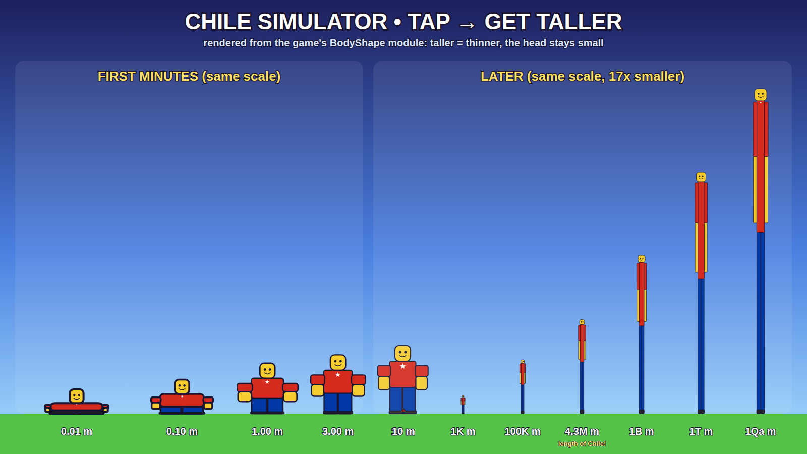

# 🇨🇱 CHILE SIMULATOR — TAP → GET TALLER

Roblox-симулятор, который понятен за 3 секунды: **нажимаешь кнопку — персонаж становится выше.**
Не «масштабируется», а **вытягивается вверх и худеет**: из плоской «котлеты» 0.01 m в нормального человечка,
потом в долговязого, потом в абсурдный столб с крошечной головой, которая уходит за облака.

> Почему Chile: Чили — самая длинная и узкая страна в мире (~4 300 km в длину, ~177 km в ширину).
> Ровно то, во что превращается твой персонаж. В игре есть веха **«🇨🇱 YOU ARE AS LONG AS CHILE! (4,300 km)»**
> и достижение «As Long As Chile».



*Картинка сгенерирована из того же модуля `BodyShape`, по которому игра строит тело (`lune run tools/render_art.luau`).*

---

## Как запустить

| | |
|---|---|
| **Windows** | двойной клик `PLAY.bat` |
| **macOS / Linux** | `PLAY.command` (при первом запуске на Mac: правый клик → «Открыть») |
| **Вручную** | открыть `ChileSimulator.rbxlx` в Roblox Studio → **Play (F5)** |
| **Для разработки** | [Rojo 7](https://rojo.space): `rojo serve` → в Studio плагин Rojo → Connect |

Скрипты сами скачают Rojo (один раз, в `tools/`), соберут игру из `src/` и откроют Studio.
Весь мир, интерфейс, звуки и эффекты создаются кодом — в Studio ничего вручную делать не нужно.

**Сохранения в Studio:** Game Settings → Security → *Enable Studio Access to API Services* (место должно быть опубликовано).
Без этого игра полностью играбельна, но работает «в памяти» и честно пишет в ⚙️ Settings: *Saving is OFF*.

**Тестовые инструменты:** в Studio (и для владельца места / `Config.ADMIN_USER_IDS`) в ⚙️ Settings есть раздел
TEST TOOLS: монеты, гемы, x10 рост, бесплатный Rebirth, все бусты, запуск события, сундук, секретный питомец,
любой геймпасс, сброс данных. Robux-товары с `Id = 0` в Studio «покупаются» бесплатно для проверки.

### Управление
| | Тап | Прочее |
|---|---|---|
| ПК | **клик мышью** (по миру или кнопке), **Space**, **Enter** | `E` — открыть яйцо, `Esc` — закрыть окно |
| Телефон / планшет | огромная кнопка **TAP TO GROW** справа внизу (мультитач) | стик слева |
| Геймпад | **R2** / **A** | `B` — закрыть окно |

Прыжок отключён намеренно: Space = тап.

### 🔘 Одна кнопка (режим по умолчанию)

Всю игру можно пройти, нажимая **только одну кнопку — TAP**. Никаких меню, магазинов и ходьбы:

* **Rebirth — та же кнопка.** Когда Rebirth готов, TAP-кнопка через 0.8 с становится фиолетовой **♻️ REBIRTH!** —
  следующее нажатие делает Rebirth (сам момент выбирает игрок, случайно не нажмёшь).
* **Всё остальное делает сервер раз в секунду** (`src/server/Logic/AutoPlay.lua`): покупает самый выгодный апгрейд
  (TAP POWER / AUTO GROW), тратит гемы на постоянные апгрейды, забирает Daily, подарки за время и квесты,
  включает бусты из инвентаря, **откладывает 25 % дохода на яйца** и вылупляет лучшее яйцо, на которое можно накопить
  за ~3 минуты (надевает лучших питомцев, при полном рюкзаке удаляет самого слабого обычного), переносит в лучший мир.
* Кнопки апгрейдов и меню свёрнуты в одну **☰ MENU**; раскрытие яиц — маленькое, не перекрывает экран;
  под кнопкой строка «🤖 AUTO: 👆 x250 🌱 +1.2 m/s 🐾 x3.4» показывает, что уже есть.
* Автопилот вызывает те же проверенные серверные функции, что и ручной интерфейс, — он не может сделать ничего,
  чего не мог бы игрок руками. Выключается в ⚙️ Settings → *One-button mode* (классический режим со всеми кнопками).

---

## Главная фишка: вытягивание (`src/shared/BodyShape.lua`)

Рост хранится в **сантиметрах** (старт 1 cm = 0.01 m, «+1 Height» = +1 cm). Форма тела интерполируется по `log10(метров)`:

| Рост | Тело (ноги+торс) | Ширина торса | Голова | Как выглядит |
|---|---|---|---|---|
| 0.01 m | 0.8 studs | 4.0 | 1.05 | плоская котлета, большая голова |
| 1 m | 2.7 | 2.45 | 1.15 | смешной коротышка |
| 10 m | 4 | 2.0 | 1.2 | нормальный Roblox-человечек |
| 1K m | 16 | 2.1 | 1.9 | долговязый |
| 1M m | 75 | 3.4 | 4.3 | столб |
| 1B m | 150 | 5.0 | 7 | абсурдный столб с крошечной головой |
| 1e30 m+ | 600–800 | ≥ 1/60 высоты | 20–26 | UNREAL |

* **Не масштаб XYZ:** высота растёт намного быстрее ширины; соотношение высота/ширина ограничено 60, ширина ≥ 0.5 stud — персонаж никогда не становится невидимой линией, голова всегда видна.
* **Каждый тап заметен:** в начале каждый тап вытягивает тело на 15–25 %; рост сглажен в лог-шкале, число в HUD растёт вместе с телом.
* **Squash & stretch:** тап сплющивает тело, пружина выстреливает его вверх с перелётом и успокаивает (сильнее тап — сильнее эффект).
* **Походка:** длинные ноги делают длинные медленные шаги, руки качаются, в покое — «дыхание».
* **Голова — твоя:** клонируется настоящая голова аватара (лицо, шапки, волосы), рубашка/штаны — цвета по UserId.

Как это устроено: настоящий R15-риг остаётся обычного размера (физика, камера, коллизии в порядке) и сделан невидимым
на сервере, а **каждый клиент рисует растянутое тело поверх него** по реплицируемому атрибуту `Height`.
Это ничего не стоит серверу и сети, работает для всех игроков одинаково и позволяет анимировать каждый тап.

---

## Core loop и темп

`TAP → HEIGHT (+ Coins) → UPGRADE → быстрее рост → REBIRTH → множитель → снова`

Игрок в режиме одной кнопки, 6 тапов/с, **настоящая серверная логика** с питомцами, бустами из наград, событиями
сервера и автопилотом — `lune run tests/balance_full.luau [минуты] [тапов/с] [seed]` (медиана по 3 серверам):

| Время | Что происходит |
|---|---|
| ~0:30 | 10 m → Normal World, первый питомец |
| **~1:20** | **первый Rebirth (100 m) → x2** (+ квест: 2x Height) |
| ~2:00 | 1K m → Cloud World, Rebirth 2 |
| ~4:00 | 10K m → Sky World |
| ~12 мин | 1M m → Space, Rebirth 5 |
| ~45 мин | 1B m → Galaxy |
| ~1 ч | Rebirth 10 |
| ~3.5 ч | 1T m; дальше Rebirth примерно раз в 40–60 минут |
| ~10 ч | ~16 Rebirth, сотни T m |

Медленный игрок (3–4 тапа/с) — Galaxy примерно за час. Голый тапер без питомцев, бустов и событий
(`lune run tests/balance.luau`): первый апгрейд на 0:07, первый Rebirth на ~2:57, 1K m ~6 мин, 1M m ~50 мин.

**Почему экономика не «взрывается».** Всё, что не является самим ростом (питомцы, бусты, события, геймпассы),
умножает рост полностью, но в формулу монет входит только в степени 0.3 (`Config.Coins.ExtraShare`): x10 роста → x2
монет. Иначе каждый множитель ещё и ускорял бы покупку апгрейдов, те — Rebirth, а Rebirth — монеты: питомцы x15
превращались бы в x10 000 000 через час (так и было, пока тест одной кнопки это не поймал). Плюс минимальные
множители цены (апгрейды x2.5, Rebirth x2.4) выше, чем прирост силы за шаг. Тест `full economy … never snowballs`
в `tests/run.luau` гоняет 3 сервера по 5 часов и падает, если Rebirth начинают идти чаще, чем раз в 2 минуты,
или 1Qa m достигается раньше 5 часов.

Числа всё время растут: 1 → 5 → 25 → 100 → 1K → 10K → 1M → 1B → 1T → 1Qa…
Стоимость апгрейдов и Rebirth — «выполаживающаяся» геометрия: крутая в начале (зоны не пролетают за минуту),
ровный ритм потом. Весь баланс — в `src/shared/Config.lua`.

### Первые 5 минут (онбординг, `TutorialController`)
1. Стрелка на **TAP TO GROW** → игрок тапает, тело заметно растёт с первого нажатия.
2. Как только хватает монет — стрелка на **TAP POWER** («Buy TAP POWER to grow faster!»).
3. «Reach 100 m to REBIRTH!» → полоса прогресса Rebirth под ростом; когда готово — «♻️ REBIRTH NOW».
4. После Rebirth — «x2 GROWTH! Now become MUCH taller 🚀». Прогресс туториала сохраняется, шаги двигает сервер по реальным действиям.

---

## Системы

| Система | Коротко |
|---|---|
| **Tap** | +TapPower cm и монеты за тап; монеты = (TapPower × Rebirth × зона × гем-бонус × прочее^0.3)^0.8 × множители монет × бонус за текущий рост |
| **TAP POWER** | x1, x2, x5, x10, x25, x50, x100, x250, x500, x1K … (150 уровней) |
| **AUTO GROW** | пассивный рост (+1, +2, +5 … cm/s) и немного монет; тап остаётся важнее |
| **Rebirth** | сброс роста, остаются монеты/апгрейды/питомцы; множитель `round(1 + r + 0.1 r²)`: R1 x2, R3 x5, R10 x21, R100 x1101; + гемы; анимация: огромный → крошечный → сплющенный → BOOM → **REBIRTH!** |
| **Зоны** | Tiny Land, Normal World (10 m), Giant City (100 m), Cloud World (1K), Sky World (10K), Space (1M), Galaxy (1B); множители x1, x1.5, x2, x2.5, x3, x4, x5, свой вид и освещение; открываются по лучшему росту навсегда; ворота + телепорт 🌍 WORLDS |
| **Шкала роста** | в каждой зоне гигантская линейка: метки стоят ровно там, где заканчивается тело такого роста |
| **Бусты** | 2x Height 15 мин, 2x Coins 15 мин, 4x Height 10 мин, Auto Tap 10 мин, Super Growth 5 мин (x10 рост, x3 монеты); инвентарь, таймер идёт только онлайн |
| **Питомцы / яйца** | Basic 100, Big 100K, Giant 100M, Galaxy 10T монет; Common…Secret (Secret 1 : 50 000); x1.05…x125; складываются аддитивно (3 × x5 = x13), чтобы не затмевать рост; Hatch 1 / 3, авто-экипировка лучших |
| **Trails / Auras** | 10 трейлов (Fire, Lightning, Rainbow, Galaxy, Void, Money, Cloud, Glitch + 2 VIP), 8 аур (Basic … Cosmic + VIP Royal); масштабируются с телом |
| **Лидерборды** | в мире у спавна: TALLEST PLAYERS / MOST REBIRTHS / MOST TAPS (all-time, OrderedDataStore) + TALLEST RIGHT NOW (сервер, live); в UI 🏆 — живой рейтинг сервера |
| **Социальное** | над головой `📏 1.25K m / [Giant] Name 👑`; у ближайшего игрока: **YOU ARE 87× TALLER** / **4.2× TALLER THAN YOU**; «🚨 YOU PASSED Name!», «👑 YOU ARE THE TALLEST IN THIS SERVER!» |
| **Вирусные моменты** | «🌱 grew out of the grass», «🏠 taller than a house», «🏙️ skyscraper», «🇨🇱 as long as Chile», «🌆 bigger than the city», «☁️ your head reached the clouds», «🌕 touched the Moon», «🚨 NEW HEIGHT RECORD», «🚨 TALLER THAN 99% OF PLAYERS» (реальная глобальная гистограмма); облака и Луна стоят на той высоте, где до них достаёт голова |
| **События сервера** | MEGA GROWTH x5 (60 с), GOLDEN MINUTE x3 монет, GIANT MODE (все огромные, x2), TINY MODE (все крошечные, рост x25, 20 с), DOUBLE TAP; каждые 4–7 мин; участникам +гемы |
| **Сундуки** | каждые 2.5–4 мин где-то рядом с игроками; кто первый добежал — тот и забрал |
| **Daily** | 7 дней: Coins → Boost → Pet → Gems → 2x Height → Rare Pet → Legendary Pet (+гемы), по кругу; пропуск дня сбрасывает серию |
| **Quests** | 3 в день: 1,000 тапов, вырасти на 1,000 m, 1 Rebirth (→ 2x Height) |
| **Gems** | за Rebirth, Daily, достижения, события, квесты; постоянные апгрейды: Tap Power, Auto Growth, Coin Multiplier, Luck, Pet Storage |
| **Достижения** | 33 штуки: First Step (1 m) … UNREAL, HOW (10,000 тапов), Addicted (1,000,000), Rebirth Master, WHAT ARE THE ODDS (Secret pet) … |
| **🎁 FREE REWARDS** | подарки за 5 / 10 / 20 / 30 / 60 минут игры |
| **Монетизация** | см. ниже |

---

## Монетизация (не pay-to-win nightmare)

Game passes: **VIP 199** (тег 👑, VIP-лаундж +20 %, x1.25 навсегда, аура Royal), **x2 Growth 149**, **x2 Coins 99**,
**Auto Tap 129**, **Extra Pet Equip 99** (+2), **Extra Pet Storage 49** (+100), **Faster Hatch 79**, **VIP Trails 69**.
Developer products: бусты (19–49), монеты (25 / 99), гемы (25 / 99), **+1 Instant Rebirth 49**.

**Как подключить:** создайте товары на Creator Dashboard и впишите их `Id` в `src/shared/ShopConfig.lua`.
Пока `Id = 0`, товар виден и тестируется только в Studio, в живой игре скрыт.
Покупки продуктов идемпотентны (обработанные `PurchaseId` хранятся в сохранении, выдача сохраняется до ответа `PurchaseGranted`).

---

## Архитектура

```
default.project.json            Rojo-проект
src/
  shared/   -> ReplicatedStorage.Shared
    Config.lua                  ВЕСЬ баланс (тапы, анти-чит, апгрейды, Rebirth, титулы, вехи, сохранение)
    BodyShape.lua               рост -> форма тела (главная фишка)
    Formulas.lua                все формулы (сервер считает, клиент только показывает)
    ZoneConfig / PetConfig / BoostConfig / CosmeticConfig / RewardConfig / EventConfig / ShopConfig
    Net.lua                     единый список RemoteEvent
    Util/Num.lua                безопасные большие числа (NaN/inf -> безопасно, клэмп 1e300)
    Util/Format.lua             1.25K, 3.4Qa, 0.01 m, +12 cm, x2.5
  server/   -> ServerScriptService.Server
    Main.server.lua             Init() всех сервисов -> Start() всех
    Logic/                      ЧИСТАЯ игровая логика без Roblox API (покрыта тестами):
      Defaults (схема + ремонт сохранения), Session, Growth (тап/анти-чит/Rebirth/апгрейды),
      Pets, Boosts, Rewards (daily/quests/playtime/achievements/milestones), Mults
    Services/                   Roblox-слой: DataService, PlayerService (сессии, ОДИН тик 1 Гц, ОДИН flush 8 Гц),
      GrowthService, PetService, RewardService (+сундуки), EventService, LeaderboardService,
      WorldService (строит весь мир), CharacterService, CosmeticService, MonetizationService, AdminService
    Util/Guard.lua              подключение RemoteEvent: сессия, rate limit, pcall
  client/   -> StarterPlayerScripts.Client
    Main.client.lua
    Controllers/  BodyController (растянутые тела, trail/aura), TapController, CameraController,
                  EffectsController, SoundController, HudController, PanelController, NotifyController,
                  SocialController, ZoneController, PetController, HatchController, TutorialController, ClientData
    UI/           Theme, Kit, Widgets, PetIcon, Purchase, Panels/* (10 окон)
    Util/PetBuilder.lua         питомцы из примитивов
  character/Animate.client.lua  пустой: дефолтные анимации невидимому ригу не нужны
tests/                          офлайн-тесты (Lune) + мини-движок для end-to-end
tools/                          check_props.py, render_art.luau, verify.sh
docs/                           growth / icon / thumbnail (+ STORE.md)
```

### Безопасность (анти-чит)
* Клиент **никогда** не присылает количества Height / Coins / Gems — только намерения: «я тапнул N раз», «открыть яйцо Basic ×3».
* Тапы: token bucket на сервере (16/с, всплеск 20, ≤ 12 в одном сообщении); Auto Tap делит тот же лимит. `1e9`, NaN, inf, дроби, строки, таблицы — отбрасываются (`Num.ValidInt`).
* Каждый RemoteEvent: сессия загружена, свой rate limit, проверка типов, `pcall`.
* Rebirth / покупки / яйца / награды / телепорты / косметика проверяются по данным сервера; RNG яиц — на сервере; время — только серверное.
* Зона (множитель) = позиция **и** открытость; в закрытой зоне или в VIP-лаундже без VIP — телепорт обратно.
* Тестовые команды и «бесплатные покупки» работают только в Studio / для админов.

### Сохранения
UpdateAsync + ретраи с backoff + ожидание бюджета; **session lock** (второй сервер ждёт и забирает профиль только после ретраев;
сервер, потерявший lock, никогда не перезапишет новые данные); autosave каждые 90 с (разнесён по времени), PlayerRemoving (+снятие lock),
BindToClose (все параллельно); `Defaults.Reconcile` чинит любые данные при загрузке и очищает их перед записью (NaN/inf не попадут в DataStore);
если DataStore недоступен при входе — игрок получает kick, а не пустой профиль поверх настоящего.
Сохраняется: рост, лучший рост, монеты, гемы, Rebirth, тапы, уровни апгрейдов и гем-апгрейдов, питомцы (+экипировка), трейлы, ауры, бусты
(инвентарь и остаток времени), достижения, вехи, daily, квесты, статистика, настройки, туториал, обработанные покупки.

### Производительность
* Сервер: 1 тик в секунду на всех игроков + 1 flush 8 Гц; частичная синхронизация только изменённых секций (≤ 8 сообщений/с на игрока при 10 тапах/с).
* Клиент: тела всех игроков двигаются одним `BulkMoveTo` за кадр; дальние тела обновляются реже; `Size` пишется только при реальном изменении; питомцы тоже одним `BulkMoveTo`.
* Мир ≈ 1 300 anchored-частей, у большинства выключены CanCollide / CanQuery / CanTouch / тени. Нет постоянных ParticleEmitter, кроме косметики; Low graphics в настройках.
* Эффекты пулятся (всплывающие числа, частицы через `Emit`).

---

## Тесты и проверка

```bash
lune run tests/run.luau          # 55 юнит-тестов: числа, форма тела, формулы, сохранения, АНТИ-ЧИТ, награды, автопилот, баланс
rojo sourcemap default.project.json -o sourcemap.json
lune run tests/e2e.luau          # 126 end-to-end проверок: НАСТОЯЩИЙ серверный и клиентский код в мини-движке
lune run tests/e2e_onebutton.luau # 15 минут игры, нажимая ТОЛЬКО кнопку TAP: апгрейды, питомцы, награды, миры, Rebirth
lune run tests/e2e_offline.luau  # Studio без доступа к API: игра работает, сохранение честно выключено
lune run tests/balance_full.luau # темп игрока «одной кнопки» (питомцы, бусты, события) по минутам
lune run tests/soak.luau 20      # 20 игровых минут, 3 игрока, случайные действия, мусорные RemoteEvent, перезаходы
tools/verify.sh                  # всё сразу (+ luau-lsp типы и проверка свойств Roblox)
```

`tests/engine.luau` — маленький «движок Roblox» на Lune: экземпляры — настоящие rbx-dom объекты (имена классов,
свойств и типы проверяются как в Roblox), планировщик `task.*` с виртуальным временем, заглушки сервисов
(DataStore с JSON-сериализацией, Marketplace, Input, Tween…), мост RemoteEvent с правилами сериализации Roblox,
репликация атрибутов сервер → клиенты. Так прогоняется реальный код игры: вход, тапы, UI-кнопки, Rebirth,
яйца, события, сохранение/перезаход, session lock, сбой DataStore, BindToClose, мобильная раскладка.

`tools/check_props.py` проверяет по определениям Roblox API каждый ключ в таблицах свойств (`Kit.New("Frame", {…})`,
`part(folder, {…})`) — то, что не видит проверка типов. Проверка типов: `luau-lsp analyze` с `globalTypes.d.luau`.

### Финальный чек-лист
| # | Проверка | Результат |
|---|---|---|
| 1 | RemoteEvents | все 20 входящих через `Guard` (сессия, rate limit, pcall); e2e: мусор во все remote — сервер не падает, ничего не выдаётся |
| 2 | DataStore | e2e: сохранение при выходе, загрузка при входе, lock снимается, чужой lock ждётся и забирается, сбой при входе → kick без перезаписи, BindToClose сохраняет всех |
| 3 | Rebirth | нельзя без роста; через UI; рост → 1 cm; монеты/апгрейды остаются; x2; гемы; анимация на клиенте |
| 4 | Tap | кнопка, клик по миру, Space/Enter; +рост и монеты; HUD и тело синхронно |
| 5 | Визуальное вытягивание | тесты формы (монотонно выше, относительно уже, никогда не линия, руки не под полом) + рендер `docs/growth.png` из того же модуля |
| 6 | Мобильное управление | e2e с `TouchEnabled`: большая кнопка справа (вне зоны стика), мультитач по кнопке растит |
| 7 | UI | все 10 панелей открываются/обновляются без ошибок; 1 085 ключей свойств проверены по Roblox API |
| 8 | Сохранение | перезаход восстанавливает Rebirth, питомцев, трейл; soak с перезаходами |
| 9 | `+1,000,000,000 Height` | невозможно: клиент не шлёт рост; `Tap(1e9)` → ≤ 12 тапов, 500 remote за кадр → ≤ лимита |
| 10 | Производительность | ≤ 8 Sync/с при 10 тапах/с; ~10 частей на тело; мир ~1 300 частей; soak 20 мин: 0 ошибок, без утечек |
| 11 | Одна кнопка | e2e: 15 минут только кнопкой TAP → апгрейды, гемы, Daily, подарки, квесты, питомцы, переход в лучший мир, 5 Rebirth той же кнопкой, ни одного блокирующего окна |
| 12 | Баланс | 3 сервера × 5 часов на настоящей логике: 1M m за 6–40 мин, Galaxy за 25–120 мин, 10–30 Rebirth, ни разу чаще раза в 2 минуты после 30-й минуты |

### Чего нельзя проверить без Roblox Studio (честно)
Офлайн-движок проверяет логику, API, свойства, сеть и UI-структуру, но не рендер и не физику Roblox.
В Studio стоит посмотреть глазами: как выглядит растянутое тело и шапки при разных ростах (Test Tools → x10 Height),
удобство камеры на очень большом росте, размеры кнопок на реальном телефоне (Device Emulator), и настоящие
DataStore / покупки на опубликованном месте.

---

Магазин: названия, описания, иконка и thumbnail — в [docs/STORE.md](docs/STORE.md).
